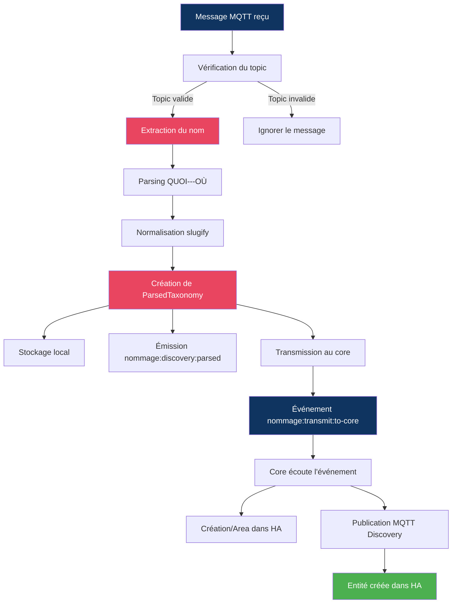

# Spécifications — Application NOMMAGE

**Version :** 2.0
**Date :** 19 Septembre 2026
**Auteur :** Mistral Vibe / Claude
**Statut :** En production
**Type :** Application d'intégration
**Dépend de :** `nommage_specs_v1.0.md` (protocole de taxonomie QUOI/OÙ — document séparé, référencé par
plusieurs applications, voir note ci-dessous), `techniques-socle-ha-mqtt_specs_v4.33.md`,
`guide-nouvelle-application_specs_v2.0.md`

> **v2.0 (19/09/2026)** — **Fusion de `fonctionnelles-nommage_specs_v1.8.md` +
> `implementation-nommage_specs_v1.8.md`** en un seul document (même demande explicite utilisateur
> que pour ARBREOUQUOI : "il y a plusieurs specs qui traitent de... pareil pour... nommage... il
> faudra bien les séparer" — fonctionnel et technique restent clairement séparés en deux parties de
> CE document). Les deux anciens documents avaient chacun, en doublon et en fin de fichier (après
> leur propre tableau "Historique des Versions", réutilisant à tort le numéro de section `9` déjà
> pris par "Exemples d'Utilisation"), une section "Communication Inter-Applications" massive
> (~400 lignes chacune, ~800 au total) décrivant des capacités `InterAppClient`/Request-Reply
> jamais implémentées — retirée, remplacée par un court pointeur unique en fin de document (voir
> `techniques-socle-ha-mqtt_specs` §9bis pour le mécanisme réel). Renvois croisés internes
> (`fonctionnelles-nommage_specs` ↔ `implementation-nommage_specs`) convertis en renvois de section
> dans ce même document — deux d'entre eux, laissés "à préciser côté implémentation" dans la v1.8
> fonctionnelle, sont maintenant résolus (§3.1, §3.4, §7.4 → Partie 2 §T4.1/§T4.2.2). Anciennes
> versions (v1.7/v1.8 des deux documents) archivées.
>
> **⚠️ Point important : `nommage_specs_v1.0.md` n'a PAS été fusionné dans ce document**, malgré la
> ressemblance de nom. Vérification faite avant fusion (grep exhaustif hors `specs/archives/`) :
> ce fichier est un **protocole de taxonomie générique** référencé par 9 documents à travers le
> dépôt (`guide-nouvelle-application_specs`, `fonctionnelles-arbreouquoi_specs`,
> `fonctionnelles-teleinfo_specs`, `fonctionnelles-rpigpio_specs`, `applications/nommage/README.md`,
> etc.) — pas seulement par l'application NOMMAGE elle-même, qui ne fait qu'**implémenter** ce
> protocole (voir §3.2/§1.1 ci-dessous, qui le référencent explicitement). Le fusionner ici aurait
> cassé ces 9 références externes et conflaté deux notions distinctes (le protocole générique vs.
> l'application qui l'applique côté MQTT). Reste un document séparé et immuable comme avant.

---

## 📚 Table des Matières

**Partie 1 — Fonctionnel**
1. [Introduction](#1-introduction)
2. [Contexte et Objectifs](#2-contexte-et-objectifs)
3. [Fonctionnalités Principales](#3-fonctionnalités-principales)
4. [Format des Données](#4-format-des-données)
5. [Flux de Traitement](#5-flux-de-traitement)
6. [Intégration avec Home Assistant](#6-intégration-avec-home-assistant)
7. [Configuration](#7-configuration)
8. [Gestion des Erreurs](#8-gestion-des-erreurs)
9. [Exemples d'Utilisation](#9-exemples-dutilisation)
10. [Évolutions Futures](#10-évolutions-futures)

**Partie 2 — Technique / Implémentation**
- T1. [Introduction](#t1-introduction)
- T2. [Architecture Technique](#t2-architecture-technique)
- T3. [Structure des Répertoires](#t3-structure-des-répertoires)
- T4. [Détails d'Implémentation](#t4-détails-dimplémentation)
- T5. [Intégration avec le Socle](#t5-intégration-avec-le-socle)
- T6. [Configuration Technique](#t6-configuration-technique)
- T7. [Tests et Validation](#t7-tests-et-validation)
- T8. [Dépannage](#t8-dépannage)

**[Communication Inter-Applications](#communication-inter-applications)** (partagé, fin de document)

---

# Partie 1 — Fonctionnel

## 1. Introduction

### 1.1 Présentation

L'application **NOMMAGE** est un module d'intégration conçu pour **normaliser et structurer** les noms des entités Home Assistant en utilisant le **protocole de nommage unifié** défini dans [nommage_specs_v1.0.md](./nommage_specs_v1.0.md).

Elle agit comme un **intermédiaire** entre les applications tierces (RFXCOM, Zigbee2MQTT, etc.) qui émettent des messages de découverte MQTT et Home Assistant, en assurant que toutes les entités suivent une **taxonomie cohérente**.

### 1.2 Public Cible

- Développeurs d'applications Home Assistant
- Intégrateurs de systèmes IoT
- Administrateurs de systèmes domotiques

### 1.3 Portée

Cette spécification couvre :
- ✅ Le parsing des noms selon le format QUOI---OÙ
- ✅ La création de structures taxonomiques
- ✅ La transmission vers Home Assistant
- ✅ La configuration MQTT et HA
- ❌ **Hors portée** : La modification du core (doit être fait séparément)

---

## 2. Contexte et Objectifs

### 2.1 Problématique

Dans un écosystème Home Assistant avec de multiples applications (RFXCOM, Zigbee2MQTT, etc.), chaque application utilise ses propres **conventions de nommage** pour les entités. Cela entraîne :

- **Incohérence** dans l'interface utilisateur
- **Difficulté** de filtrage et de regroupement des entités
- **Complexité** de maintenance et d'automatisation

### 2.2 Solution

L'application NOMMAGE **intercepte les messages de découverte MQTT** et applique une **normalisation systématique** basée sur :

1. **Séparation** du QUOI (type de l'entité) et des OÙ (hiérarchie géographique)
2. **Normalisation** des chaînes (slugify) pour la compatibilité HA
3. **Structuration** en Areas, Devices et Entités
4. **Transmission** des informations taxonomiques à HA

### 2.3 Objectifs Fonctionnels

| ID | Objectif | Critère de Succès |
|----|----------|-------------------|
| OF-1 | Écouter les messages de découverte MQTT | Messages reçus et validés |
| OF-2 | Parser les noms selon QUOI---OÙ | Structure taxonomique correcte |
| OF-3 | Normaliser les chaînes (slugify) | Pas de caractères spéciaux |
| OF-4 | Transmettre à Home Assistant | Entités créées avec attributs taxonomie |
| OF-5 | Gérer la configuration | Paramètres MQTT et HA configurables |
| OF-6 | Afficher le statut | UI avec indicateurs de connexion |

---

## 3. Fonctionnalités Principales

### 3.1 Écoute MQTT — Sources Multiples Simultanées

> **⭐ v1.1** : NOMMAGE peut lire depuis **plusieurs sources MQTT indépendantes**, traitées
> **simultanément** (pas seulement configurées — voir §4.3). Une source = une connexion à un
> broker MQTT (potentiellement distinct du broker HA) avec ses propres topics de découverte.
>
> **⚠️ v1.2** : Cette description v1.1 n'était pas implémentée — le code ne connectait et ne
> traitait en réalité que `couples[0]` (la première entrée), quel que soit le nombre d'entrées
> configurées. Corrigé : `NommageMqttIntegrationService` gère désormais une connexion MQTT
> (`mqtt.MqttClient`) par source dans une `Map<sourceId, MqttClient>`, toutes connectées en
> parallèle via `Promise.allSettled` (voir **Partie 2 §T4.1**).

**Description :** NOMMAGE écoute les messages de découverte MQTT émis par d'autres applications ou
systèmes, sur **une ou plusieurs sources en parallèle**. Chaque source dispose de sa propre
connexion MQTT, de ses propres identifiants, et de ses propres topics de découverte.

**Cas d'usage type — sources multiples :**
- Une application locale (ex: RFXCOM) publie sa découverte sur le broker HA lui-même, préfixée
  `ha/...` (topics par défaut)
- Zigbee2MQTT, sur ce **même broker** que HA, publie volontairement sa découverte sur un préfixe
  **différent** de `homeassistant/` (ex: `homeassist/...`) pour ne pas être auto-découvert
  directement — NOMMAGE doit lire ce flux séparément, l'enrichir, et le relayer (voir §3.4)
- Un système tiers pourrait être sur un **broker MQTT complètement différent**
- Ces trois cas sont représentés par **trois sources distinctes**, connectées et traitées
  **en même temps**, pas l'une après l'autre

**Fonctionnalités (par source) :**
- Connexion indépendante (host, port, credentials propres à la source)
- Abonnement à des **topics configurables** (par défaut : `ha/+/+/config`, `homeassistant/+/+/config`)
- Support des **wildcards** MQTT (`+`, `#`)
- Gestion de la **reconnexion automatique**, indépendante des autres sources (la perte d'une
  source n'affecte pas le traitement des autres)
- **Validation** du format des messages

**Entrées :**
- Configuration MQTT **par source** (host, port, topics, credentials) — voir §4.3 `sources[]`
- Messages MQTT au format JSON, sur chacune des sources actives

**Sorties :**
- Événement interne `nommage:discovery:raw` sur EventBus, avec l'**identifiant de la source**
  d'origine dans le payload (`sourceId`) — voir §4.2

### 3.2 Parsing QUOI/OÙ

**Description :** Analyse et segmentation des noms selon le protocole de nommage unifié.

**Algorithme :**
1. **Séparer** le QUOI des OÙ via le délimiteur `---`
2. **Extraire** les niveaux géographiques via le délimiteur `--`
3. **Distribuer** selon la matrice de [nommage_specs_v1.0.md](./nommage_specs_v1.0.md) §3.3
4. **Normaliser** chaque segment (slugify)

**Matrice de Distribution :**

| N (segments) | Lieu Précis | Lieu (Area) | Lieu Père (Floor) | Lieu Grand-Père |
|--------------|-------------|-------------|------------------|-----------------|
| 0 | ❌ | ❌ | ❌ | ❌ |
| 1 | ❌ | Segment 0 | ❌ | ❌ |
| 2 | Segment 0 | Segment 1 | ❌ | ❌ |
| 3 | Segment 0 | Segment 1 | Segment 2 | ❌ |
| ≥4 | Segment 0 | Segment 1 | Segment 2 | Segment 3 |

**Exemple :**
```
Entrée : "Sèche-serviette---Détecteur Douche--Salle de Bain--Rez-de-Chaussée--Maison"
Sortie :
  QUOI: "Sèche-serviette" → slug: "seche_serviette"
  Lieu Précis: "Détecteur Douche" → slug: "detecteur_douche"
  Lieu: "Salle de Bain" → slug: "salle_de_bain" ⭐
  Lieu Père: "Rez-de-Chaussée" → slug: "rez_de_chaussee"
  Lieu Grand-Père: "Maison" → slug: "maison"
```

### 3.3 Génération des Attributs HA

**Description :** Création des attributs compatibles avec Home Assistant.

**Attributs Générés :**
```yaml
attributs_taxonomie:
  quoi: "Sèche-serviette"
  slug_quoi: "seche_serviette"
  lieu_precis: "Détecteur Douche"
  slug_precis: "detecteur_douche"
  lieu_principal: "Salle de Bain" ⭐
  slug_lieu: "salle_de_bain" ⭐
  lieu_pere: "Rez-de-Chaussée"
  slug_pere: "rez_de_chaussee"
  lieu_grand_pere: "Maison"
  slug_grand_pere: "maison"
```

**Règles :**
- **`lieu_principal`** (NOMMAGE: `nom_lieu`) est **obligatoire** et utilisé pour créer l'Area HA
- Les autres niveaux sont **optionnels** et stockés en attributs
- Les attributs sont **injectés** dans les entités HA via MQTT Discovery

### 3.4 Transmission vers Home Assistant — Passthrough MQTT

> **⭐ v1.1** : Le mécanisme de transmission repose désormais sur le **Passthrough MQTT** du socle
> ([`techniques-socle-ha-mqtt_specs` §8.5.6](techniques-socle-ha-mqtt_specs_v4.33.md#856-passthrough-mqtt)),
> et **remplace** l'ancien mécanisme `nommage:transmit:to-core` (qui restait vague sur "WebSocket ou MQTT").

**Description :** Le message de découverte d'origine (lu sur une source, §3.1) est **enrichi** avec
les attributs de taxonomie puis **relayé tel quel** vers le broker HA unique du socle, via le mode
**Découverte** du Passthrough MQTT — NOMMAGE ne reconstruit pas un message HA de toutes pièces,
elle republie le message source enrichi, avec réécriture du préfixe du topic.

**Méthode :**
1. NOMMAGE injecte `attributs_taxonomie` (voir §3.3) dans le payload JSON d'origine
1bis. **⭐ v1.5** — si `payload.name` (le nom d'entité fourni par la source) a une correspondance
dans le dictionnaire de traduction actif (voir §3.7 — clé = `object_id`, le dernier segment du
topic avant `/config`, pas `name` lui-même), il est remplacé par le libellé traduit. Sans
correspondance, `payload.name` n'est **pas** touché (un `name` absent côté source ne doit pas
devenir explicitement `null` : ce sont deux comportements différents pour HA — voir §3.7).
2. NOMMAGE émet `integration:nommage:passthrough:discovery` sur l'EventBus, avec :
   - `sourceTopic` = le topic **d'origine** du message (ex: `ha/sensor/temp_cuisine/config` ou
     `homeassist/sensor/temp_salon/config`) — préfixe **non modifié** par NOMMAGE
   - `payload` = le message JSON source, enrichi des attributs de taxonomie
3. Le socle (`HaMqttIntegrationService`) remplace le **premier segment** de `sourceTopic` par
   `homeassistant` et publie le résultat (QoS 1, retain `true`) — voir **Partie 2 §T5.3** pour le
   détail technique (événement, `bridgeInstance`, code du socle)

**Événement émis (`integration:nommage:passthrough:discovery`) :**
```typescript
{
  sourceTopic: string,   // Ex: "homeassist/sensor/temp_salon/config" (préfixe source, inchangé)
  payload: {
    // Payload JSON d'origine du message de découverte, enrichi :
    ...payloadOriginal,
    attributs_taxonomie: {
      quoi: string,
      slug_quoi: string,
      lieu_precis?: string,
      slug_precis?: string,
      lieu_principal: string,   // ⭐ OBLIGATOIRE (voir §3.2)
      slug_lieu: string,
      lieu_pere?: string,
      slug_pere?: string,
      lieu_grand_pere?: string,
      slug_grand_pere?: string
    }
  }
}
```

**Événement interne conservé pour l'UI/le suivi (`nommage:discovery:parsed`) :**
```typescript
{
  type: 'nommage:discovery:parsed',
  sourceId: string,          // ⭐ Identifiant de la source d'origine (§4.3)
  discoveryMessage: {
    rawName: string,
    topic: string,            // Topic source (préfixe non modifié)
    payload: Record<string, unknown>
  },
  parsedTaxonomy: {
    quoi: { raw: string; slug: string },
    ou: {
      lieu?: { raw: string; slug: string },  // ⭐ OBLIGATOIRE
      precis?: { raw: string; slug: string },
      pere?: { raw: string; slug: string },
      grandPere?: { raw: string; slug: string }
    }
  },
  timestamp: Date
}
```

### 3.5 Interface Utilisateur

**Description :** UI minimale pour visualiser le statut et les activités.

**Fonctionnalités :**
- Affichage du **statut de connexion** (Application + MQTT)
- ⭐ **v1.2** — **Statut par connexion** : une ligne par source configurée, affichant son
  identifiant (`sources[].id`) et son état (connectée/déconnectée). Contrairement au statut MQTT
  global (qui indique "au moins une source connectée"), cette liste permet de voir précisément
  quelle source a un problème.
- ⭐ **v1.2** — **Entrées traitées par jour, sur 5 jours glissants** : un tableau affichant, pour
  chacun des 5 derniers jours (aujourd'hui compris), le nombre de messages de découverte parsés
  avec succès ce jour-là. Toujours 5 colonnes, avec 0 pour les jours sans activité. Ce compteur est
  **en mémoire** (comme le compteur global `parsedMessagesCount`) : il repart à zéro à chaque
  redémarrage de l'application, il ne s'agit pas d'un historique persistant.
- Liste des **topics de découverte** configurés (agrégés de toutes les sources)
- Compteur des **messages parsés**
- Date du **dernier parsing**
- Boutons pour **rafraîchir** et **tester**

**URL :** `/applications/nommage/presentation/index.html`

> **⚠️ v1.2** : Le segment `presentation/` fait partie intégrante de cette URL (routage confirmé
> par `ModuleContainer.ts` du core) — ne pas le retirer des chemins des scripts/styles de la page,
> erreur constatée en pratique qui empêchait le chargement du script (voir
> `guide-nouvelle-application_specs` §3.8).

### 3.6 Configuration

**Description :** Gestion des paramètres de l'application.

**Sections :**
1. **MQTT** : Connexion au broker
2. **Home Assistant** : Paramètres de transmission
3. **Logging** : Niveau de logs et débogage

**Méthodes :**
- Configuration via **UI** (Paramètres Techniques)
- Configuration via **fichier** (`data/nommage/config.yaml`)
- **Validation** avec Zod
- **Rechargement à chaud** (redémarrage automatique)

### 3.7 ⭐ Traduction des noms d'entité (`TranslationsRepository`, v1.5)

**Problème** : HA ne traduit un nom d'entité que lorsqu'il le calcule lui-même depuis
`device_class` (entité sans `name` propre) — un `name` explicite fourni par la source (ex:
zigbee2mqtt `"Linkquality"`, `"Child lock"`) traverse HA tel quel, jamais traduit. Certaines
entités (ex : les champs Linky `EAST`/`EASF01`/`EASF02`...) n'ont même **aucun** `name` côté
source alors qu'elles partagent toutes le même `device_class` — sans intervention, elles
seraient indiscernables les unes des autres dans HA.

**Principe** : un dictionnaire `object_id -> libellé` par pays, appliqué dans
`emitPassthroughDiscovery` (§3.4, étape 1bis) **avant** relais vers HA — remplace toute
surcharge ponctuelle qui vivrait côté source (ex: l'ancien réglage par propriété
`devices.<id>.homeassistant.<propriété>.name` de zigbee2mqtt, abandonné pour n'avoir qu'un
seul endroit à maintenir).

**Deux répertoires de fichiers YAML** (un fichier par pays, `translate-<pays>.yaml`,
`<pays>` en minuscules) :
- **Seeds versionnés avec le code** : `applications/nommage/src/defaultconfig/` — pour
  l'instant `translate-france.yaml` (cible) et `translate-english.yaml` (référence/repli,
  valeurs = noms d'origine tels que publiés par la source avant toute traduction). Copiés dans
  `dist/defaultconfig` au build.
- **Fichiers runtime, modifiables sans rebuild** : `data/nommage/translations/` — chaque seed y
  est copié au démarrage **sans jamais écraser un fichier déjà présent** : une modification
  manuelle survit à un redémarrage ou une mise à jour de l'application.

**Pays configuré sans fichier connu** (ni seed, ni déjà présent en runtime) : généré à la volée
— mêmes clés que `translate-france.yaml` (liste de référence), valeurs reprises de
`translate-english.yaml` (repli, aucune vraie traduction) — à corriger manuellement ensuite ;
aucun mécanisme de mise à jour automatique n'est prévu pour l'instant (décision explicitement
différée).

**Clé de recherche = `object_id`** (dernier segment du topic de découverte avant `/config`),
**pas** le `name` d'origine : seul `object_id` est toujours présent, y compris pour les entités
sans `name` propre côté source (voir Linky ci-dessus). Une entrée absente du dictionnaire laisse
`payload.name` totalement intact (§3.4, étape 1bis) — jamais transformé en `name: null` (qui
change le comportement d'affichage de HA, voir `techniques-socle-ha-mqtt_specs` §8.5.4).

**Configuration** (voir §4.3/§7.1) : `nommage.language.country` (défaut `"France"`) — désigne un
nom de pays, pas un code de langue ISO.

---

## 4. Format des Données

### 4.1 Message MQTT Entrant

**Format attendu :** JSON avec un champ `name` ou `raw_name`

```json
{
  "name": "Sèche-serviette---Détecteur Douche--Salle de Bain",
  "device_class": "temperature",
  "unique_id": "rfxcom_temperature_001",
  "state_topic": "homeassistant/sensor/rfxcom_temperature_001/state",
  "unit_of_measurement": "°C"
}
```

**Champs reconnus (par ordre de priorité, ⭐ v1.6 — `device.name` en premier, voir bandeau de
version en tête de document) :**
1. `device.name` → Nom à parser — porte la convention `QUOI---LIEU`, contrairement au nom d'une
   entité individuelle (§3.1 point 1bis)
2. `name` → Nom à parser (repli si pas de bloc `device`, ex: sources sans regroupement par
   appareil)
3. `raw_name` → Nom à parser
4. Le payload entier est traité comme une chaîne

### 4.2 Structure Parsée (ParsedTaxonomy)

```typescript
{
  // QUOI (Type de l'entité)
  quoi: {
    raw: "Sèche-serviette",
    slug: "seche_serviette"
  },
  
  // OÙ (Hiérarchie géographique)
  ou: {
    precis?: { raw: "Détecteur Douche", slug: "detecteur_douche" },
    lieu?: { raw: "Salle de Bain", slug: "salle_de_bain" },  // ⭐ OBLIGATOIRE
    pere?: { raw: "Rez-de-Chaussée", slug: "rez_de_chaussee" },
    grandPere?: { raw: "Maison", slug: "maison" }
  },
  
  // Pour Home Assistant
  haAreaId?: "salle_de_bain",
  haAreaName?: "Salle de Bain",
  haEntityId?: "sensor.nommage_seche_serviette_salle_de_bain",
  haDeviceClass?: "temperature",
  
  // Attributs à injecter dans HA
  haAttributes: {
    attributs_taxonomie: {
      quoi: "Sèche-serviette",
      slug_quoi: "seche_serviette",
      lieu_precis: "Détecteur Douche",
      slug_precis: "detecteur_douche",
      lieu_principal: "Salle de Bain",
      slug_lieu: "salle_de_bain",
      lieu_pere: "Rez-de-Chaussée",
      slug_pere: "rez_de_chaussee",
      lieu_grand_pere: "Maison",
      slug_grand_pere: "maison"
    },
    // Autres attributs du message original
    device_class: "temperature",
    unit_of_measurement: "°C"
  },
  
  // Métadonnées
  sourceTopic: "ha/sensor/temperature/config",
  sourcePayload: { ... }
}
```

### 4.3 Configuration (NommageConfig)

> **⭐ v1.1** : `mqtt` (objet unique) est **remplacé** par `sources` (tableau). **Toutes les
> sources du tableau sont connectées et traitées simultanément** — ce n'est pas une liste dont
> seule la première entrée serait active.

```typescript
{
  enabled: boolean;  // default: true
  
  // ⭐ v1.1 — Une ou plusieurs sources MQTT, toutes actives en parallèle (voir §3.1)
  sources: NommageSourceConfig[];  // default: une seule source sur le broker HA (voir §7.1)
  
  // Transmission vers HA — commune à toutes les sources (voir §3.4, Passthrough MQTT du socle)
  ha: {
    injectTaxonomyAttributes: boolean; // default: true
    waitForHaWsBeforeDiscovery: boolean; // default: true — attendre le référentiel HA avant de publier
  },
  
  logging: {
    level: 'debug' | 'info' | 'warn' | 'error'; // default: "info"
    showRawMessages: boolean;  // default: false
    showParsedMessages: boolean; // default: false
  },

  // ⭐ v1.5 — Pays dont les traductions de noms d'entité sont chargées (voir §3.7)
  language: {
    country: string; // default: "France" — nom de pays, pas un code de langue ISO
  }
}
```

**`NommageSourceConfig` (un élément de `sources[]`) :**
```typescript
{
  id: string;              // ⭐ Identifiant unique de la source (ex: "ha-broker", "zigbee2mqtt")
                            //    Utilisé dans les logs, l'UI, et le champ sourceId des événements
  
  mqtt: {
    host: string;           // default: "localhost" — ⭐ v1.7 : NE JAMAIS mettre "127.0.0.1"/
                             //   "localhost" en pratique, même si le broker tourne sur la même
                             //   machine que nommage (ce fichier est candidat à une duplication
                             //   identique vers d'autres machines) — toujours l'IP LAN réelle
    port: number;           // default: 1883, min: 1, max: 65535
    username?: string;
    password?: string;
    clientId: string;       // ⭐ v1.7 : PRÉFIXE seul (doit être unique par source SUR CETTE
                             //   MACHINE) — DIMOTIC_MACHINE_ID y est ajouté à la connexion
                             //   (computeBridgeInstance()), jamais unique global à assurer
                             //   soi-même, dupliable tel quel entre machines (default: "nommage-{id}")
    keepalive: number;     // default: 60, min: 0, max: 300
    reconnectPeriod: number; // default: 5000, min: 1000, max: 300000
    cleanSession: boolean;  // default: true
    discoveryTopics: string[]; // default: ["ha/+/+/config", "homeassistant/+/+/config"]
    topicPrefix: string;    // default: "ha/" — préfixe attendu des topics de cette source
    qos: 0 | 1 | 2;         // default: 1
    retain: boolean;        // default: true
    useTls: boolean;        // default: false
    rejectUnauthorized: boolean; // default: true
  }
}
```

**Règles :**
- `sources` **DOIT** contenir au moins un élément
- Chaque `id` de source **DOIT** être unique dans le tableau
- Chaque `clientId` MQTT (préfixe, ⭐ v1.7) **DOIT** être unique entre toutes les sources de **cette
  machine** — deux sources connectées au même broker avec le même `clientId` effectif (préfixe +
  `DIMOTIC_MACHINE_ID`) provoqueraient une déconnexion mutuelle en boucle (règle du protocole MQTT :
  un `clientId` identique sur une deuxième connexion éjecte la première). L'ajout automatique de
  l'identifiant de machine élimine le risque **entre machines différentes** ; l'unicité **au sein
  d'une même machine**, entre sources, reste à la charge de l'utilisateur.
- La perte de connexion d'une source **ne doit pas** interrompre le traitement des autres sources
  (reconnexion indépendante, voir §3.1 et §8.1)

### 4.4 Statut (NommageStatus) — ⭐ NOUVEAU v1.2

Structure émise sur l'événement persistant `nommage:status` (reçu automatiquement par tout nouveau
client Socket.io, voir §7 `guide-nouvelle-application_specs`) :

```typescript
{
  connected: boolean;             // Statut de l'application
  mqttConnected: boolean;         // true si AU MOINS UNE source est connectée
  discoveryTopics: string[];      // Topics agrégés de toutes les sources
  parsedMessagesCount: number;    // Compteur global depuis le démarrage
  lastParsedAt?: Date;
  error?: string;

  // ⭐ v1.2 — Statut détaillé par connexion, une entrée par source configurée
  sources: {
    id: string;                   // sources[].id
    connected: boolean;
  }[];

  // ⭐ v1.2 — Entrées traitées par jour, 5 derniers jours (plus ancien → plus récent).
  // Toujours 5 éléments, 0 pour les jours sans entrée traitée. En mémoire (non persisté).
  dailyCounts: {
    date: string;                 // Format "AAAA-MM-JJ"
    count: number;
  }[];
}
```

---

## 5. Flux de Traitement



**Détail des étapes :**

1. **Réception MQTT** : `NommageMqttIntegrationService` reçoit un message
2. **Validation du topic** : Vérifie que le topic correspond aux patterns configurés
3. **Extraction du nom** : Récupère `device.name`, `name` ou `raw_name` du payload (⭐ v1.6, voir
   §4.1 pour l'ordre de priorité exact et sa justification)
4. **Parsing** : Séparation QUOI/OÙ et distribution des niveaux géographiques
5. **Normalisation** : Application de slugify sur chaque segment
6. **Création de la structure** : Génération de `ParsedTaxonomy`
7. **Stockage** : Mise en mémoire des structures pour l'UI
8. **Émission EventBus** : Diffusion aux écouteurs internes
9. **Transmission au core** : Événement pour envoi à HA
10. **Traitement par le core** : Création des Areas et entités dans HA

---

## 6. Intégration avec Home Assistant

> **⭐ v1.1** : Cette section est réécrite pour refléter le mécanisme de **Passthrough MQTT**
> (§3.4). L'ancienne approche (le core reconstruit un message HA complet et appelle l'API
> WebSocket pour créer les Areas) est **abandonnée** : NOMMAGE relaie le message source enrichi,
> et c'est **Home Assistant lui-même** qui crée les Areas à partir du champ `suggested_area` /
> des attributs de taxonomie, via ses propres automatisations MQTT (voir `nommage_specs` §6).

### 6.1 Répartition des responsabilités

| Responsabilité | Qui |
|---|---|
| Lire les sources MQTT, parser QUOI/OÙ, enrichir le payload | **NOMMAGE** (domaine métier) |
| Réécrire le préfixe du topic et publier sur le broker HA | **Socle** (`HaMqttIntegrationService`, Passthrough MQTT §3.4) |
| Créer les Areas, associer les entités | **Home Assistant** (via ses automatisations MQTT natives, voir `nommage_specs`) |

NOMMAGE ne construit **jamais** elle-même un message de découverte HA complet, et n'appelle
**jamais** l'API WebSocket HA — voir §3.4 pour le détail du flux de transmission.

### 6.2 Indépendance vis-à-vis du Référentiel HA (`HaStructureRegistry`)

> ⚠️ **Point important, à ne pas confondre :**

- Le référentiel structuré (`HaStructureRegistry`) **n'est jamais mis à jour à partir des
  messages MQTT** — ni la découverte, ni le passthrough de NOMMAGE ne le modifient directement.
  Il est alimenté **exclusivement** par la connexion **HA WebSocket** (Mode A) : c'est HA
  lui-même qui **notifie par WS** (`state_changed`, `entity_registry_updated`, etc.) quand une
  entité est créée ou modifiée — y compris une entité créée à la suite d'une découverte MQTT que
  NOMMAGE aurait relayée. C'est cette notification WS, native à HA, qui met à jour le référentiel.
- Le référentiel **peut ne pas exister du tout** : il n'est initialisé que si `ha.ws_enable = true`
  (voir `techniques-socle-ha-mqtt_specs` §8.1).
- **NOMMAGE ne nécessite que `ha.mqtt_enable`** — elle n'a **aucune dépendance** sur
  `ha.ws_enable` ni sur `HaStructureRegistry` pour fonctionner (`requiredHaWs: false`, cohérent
  avec la déclaration du module — voir **Partie 2 §T4.3**). Si le WS est désactivé, NOMMAGE continue de fonctionner
  normalement (lecture des sources, enrichissement, passthrough) ; seul le référentiel structuré
  (utilisé par d'autres applications comme ARBREOUQUOI) sera absent — indépendamment de NOMMAGE.

---

## 7. Configuration

### 7.1 Configuration de Base

**Fichier :** `data/nommage/config.yaml` (objet nu, ex-section `nommage` de l'ancien fichier
unique — voir `techniques-socle-ha-mqtt_specs` §7)

```yaml
enabled: true

# ⭐ v1.1 — Tableau de sources, toutes connectées et traitées simultanément (voir §3.1)
sources:
  - id: "ha-broker"
    mqtt:
      host: "192.168.1.100"     # Broker HA lui-même
      port: 1883
      username: "user"
      password: "password"
      clientId: "nommage-ha-broker"
      discoveryTopics:
        - "ha/+/+/config"
      topicPrefix: "ha/"
      qos: 1
      retain: true

  - id: "zigbee2mqtt"
    mqtt:
      host: "192.168.1.100"     # Même broker que HA...
      port: 1883
      username: "user"
      password: "password"
      clientId: "nommage-zigbee2mqtt"
      discoveryTopics:
        - "homeassist/+/+/config"  # ...mais préfixe différent (volontaire, voir §3.1)
      topicPrefix: "homeassist/"
      qos: 1
      retain: true

ha:
  injectTaxonomyAttributes: true

logging:
  level: "info"
  showRawMessages: false
  showParsedMessages: false
```

### 7.2 Configuration via UI

**Accès :** Paramètres Techniques > Gestion des Applications > NOMMAGE > Configurer

**Champs configurables :**
- **Sources MQTT** (une ou plusieurs, ajout/suppression dynamique) : ID, Host, Port, Credentials, Topics, QoS, TLS
- **Home Assistant** : Injection des attributs de taxonomie
- **Logging** : Niveau, Afficher messages bruts/parsés

### 7.3 Validation

Toute configuration est **validée avec Zod** avant application.

**Règles de validation :**
- `sources` : tableau non vide (au moins une source)
- `sources[].id` : string non vide, unique dans le tableau
- `sources[].mqtt.host` : string non vide — ⭐ v1.7 : jamais `127.0.0.1`/`localhost` en pratique
  (non imposé par le schéma Zod, juste un `hint` d'avertissement dans l'UI)
- `sources[].mqtt.port` : 1-65535
- `sources[].mqtt.qos` : 0, 1 ou 2
- `sources[].mqtt.clientId` : string non vide, préfixe unique entre toutes les sources **de cette
  machine** (⭐ v1.7 — `DIMOTIC_MACHINE_ID` ajouté à la connexion, voir §4.3)
- `logging.level` : 'debug' | 'info' | 'warn' | 'error'

### 7.4 ⭐ Application à chaud d'une sauvegarde de configuration (v1.4)

NOMMAGE n'a pas de page de configuration dédiée (§7.2 : accès via le formulaire générique "Paramètres
du Module" du core, pas un `config.html` propre). Jusqu'à cette version, une sauvegarde via ce
formulaire persistait bien la nouvelle configuration sur disque, mais **les connexions MQTT en
cours continuaient de tourner avec les anciens paramètres** jusqu'au redémarrage complet de
l'application — seul le fichier était à jour, pas le service en cours d'exécution (constaté en
vérifiant en direct sur demande explicite de l'utilisateur).

**Corrigé** : la sauvegarde via le formulaire générique déclenche désormais la même reconnexion à
chaud des sources MQTT qu'une sauvegarde via un chemin dédié — toutes les sources sont
déconnectées puis reconnectées avec la configuration rechargée. Voir **Partie 2 §T4.2.2** pour le
détail technique (événement écouté, méthode déclenchée).

### 7.5 ⭐ Republication de la découverte au signal HA online (v1.6)

**Constat** : NOMMAGE ne republiait la découverte qu'à la connexion de **ses propres** clients
MQTT (démarrage, reconnexion réseau). Si HA lui-même redémarre sans que ces clients ne se
déconnectent (broker resté up), HA repart avec un registre vide sans jamais recevoir de nouvelle
découverte — les areas/devices/entités ne sont jamais recréés.

**Corrigé** : NOMMAGE écoute désormais `integration:nommage:ha:online` (second déclencheur du
socle, alimenté par le birth message MQTT natif de HA — voir `techniques-socle-ha-mqtt_specs`
§8.5.4bis) et appelle la **même** `reloadConfigAndReconnectMqtt()` que §7.4. NOMMAGE n'entretient
pas de registre local des devices déjà découverts (passthrough réactif, pas de suivi d'état) : une
reconnexion complète de toutes les sources plutôt qu'une republication ciblée est donc le mécanisme
le plus simple — un nouvel abonnement fait redélivrer par le broker tous les messages de découverte
retenus, qui repassent alors par le pipeline normal (`suggested_area`, traductions §3.7...) comme à
la connexion initiale.

---

## 8. Gestion des Erreurs

### 8.1 Erreurs de Connexion MQTT

| Erreur | Action | Log | Notification UI |
|--------|--------|-----|-----------------|
| Broker inaccessible | Reconnexion automatique | ERROR | ⚠️ Déconnecté |
| Authentification échouée | Arrêt de la reconnexion | ERROR | ⚠️ Erreur d'auth |
| Timeout de connexion | Nouvelle tentative | WARN | ⚠️ Timeout |

### 8.2 Erreurs de Parsing

| Erreur | Action | Log | Notification UI |
|--------|--------|-----|-----------------|
| Format invalide (pas de `---`) | Ignorer le message | WARN | - |
| JSON invalide | Ignorer le message | WARN | - |
| Champ name manquant | Utiliser payload comme string | DEBUG | - |
| Erreur de slugify | Valeur par défaut | ERROR | ⚠️ Erreur de parsing |

### 8.3 Erreurs de Transmission

| Erreur | Action | Log | Notification UI |
|--------|--------|-----|-----------------|
| Core non connecté | Retry après délai | WARN | ⚠️ Transmission en attente |
| Erreur HA API | Ignorer | ERROR | ⚠️ Erreur HA |

---

## 9. Exemples d'Utilisation

### 9.1 Exemple 1 : Message Simple

**Message MQTT :**
```json
{
  "name": "Température---Salon",
  "unique_id": "temp_salon_001",
  "device_class": "temperature",
  "state_topic": "homeassistant/sensor/temp_salon_001/state",
  "unit_of_measurement": "°C"
}
```

**Parsing :**
```typescript
{
  quoi: { raw: "Température", slug: "temperature" },
  ou: {
    lieu: { raw: "Salon", slug: "salon" }  // ⭐ N=1 : seul LIEU
  },
  haEntityId: "sensor.nommage_temperature_salon",
  haAttributes: {
    attributs_taxonomie: {
      quoi: "Température",
      slug_quoi: "temperature",
      lieu_principal: "Salon",
      slug_lieu: "salon"
    },
    device_class: "temperature",
    unit_of_measurement: "°C"
  }
}
```

**Résultat dans HA :**
- Area créée : **Salon**
- Entité créée : **sensor.nommage_temperature_salon**
- Attributs : `attributs_taxonomie.quoi = "Température"`

---

### 9.2 Exemple 2 : Message Complet (N=4)

**Message MQTT :**
```json
{
  "name": "Sèche-serviette---Détecteur Douche--Salle de Bain--Rez-de-Chaussée--Maison Principale",
  "device_class": "humidity",
  "unique_id": "rfxcom_humidity_001"
}
```

**Parsing :**
```typescript
{
  quoi: { raw: "Sèche-serviette", slug: "seche_serviette" },
  ou: {
    precis: { raw: "Détecteur Douche", slug: "detecteur_douche" },
    lieu: { raw: "Salle de Bain", slug: "salle_de_bain" },  // ⭐ Area HA
    pere: { raw: "Rez-de-Chaussée", slug: "rez_de_chaussee" },
    grandPere: { raw: "Maison Principale", slug: "maison_principale" }
  },
  haEntityId: "sensor.nommage_seche_serviette_salle_de_bain",
  haAttributes: {
    attributs_taxonomie: {
      quoi: "Sèche-serviette",
      slug_quoi: "seche_serviette",
      lieu_precis: "Détecteur Douche",
      slug_precis: "detecteur_douche",
      lieu_principal: "Salle de Bain",
      slug_lieu: "salle_de_bain",
      lieu_pere: "Rez-de-Chaussée",
      slug_pere: "rez_de_chaussee",
      lieu_grand_pere: "Maison Principale",
      slug_grand_pere: "maison_principale"
    },
    device_class: "humidity"
  }
}
```

**Résultat dans HA :**
- Areas créées : **Maison Principale**, **Rez-de-Chaussée**, **Salle de Bain**
- Entité créée : **sensor.nommage_seche_serviette_salle_de_bain**
- Attributs : Tous les niveaux de taxonomie disponibles

---

### 9.3 Exemple 3 : Message sans Sépérateur `---`

**Message MQTT :**
```json
{
  "name": "Température Salon",
  "unique_id": "temp_salon_simple"
}
```

**Parsing :**
```typescript
{
  quoi: { raw: "Température Salon", slug: "temperature_salon" },
  ou: {}  // ❌ Aucun OÙ détecté
}
```

**Résultat :**
- **Aucune Area créée** (pas de `nom_lieu`)
- Entité créée avec `quoi` uniquement
- **Warning log** : "Format de nom non valide ou incomplet"

---

## 10. Évolutions Futures

### 10.1 Améliorations Prévues

| ID | Amélioration | Priorité | Version |
|----|--------------|----------|---------|
| EA-1 | Support des patterns de topics plus complexes | Moyenne | v1.1 |
| EA-2 | Validation avancée des noms (regex) | Faible | v1.1 |
| EA-3 | Historique des messages parsés | Moyenne | v1.2 |
| EA-4 | Filtrage des messages par type | Faible | v1.2 |
| EA-5 | Export des structures au format YAML | Faible | v1.2 |
| ~~EA-6~~ | ~~Intégration avec Zigbee2MQTT~~ → **Rendue possible par les sources multiples + Passthrough MQTT (§3.1, §3.4)** | — | **v1.1** ✅ |
| EA-7 | Support des templates Jinja2 pour HA | Élevée | v1.3 |

### 10.2 Compatibilité

**Version HA :** 2024.6+ (recommandé)

**Broker MQTT :** Mosquitto 2.0+, EMQX, HiveMQ

**Node.js :** 20 LTS+

---

# Partie 2 — Technique / Implémentation

## T1. Introduction

Cette partie détaille l'**implémentation technique** de l'application NOMMAGE, en complément de la
Partie 1 (fonctionnel) ci-dessus.

**Public cible :**
- Développeurs souhaitant étendre ou maintenir l'application
- Intégrateurs souhaitant comprendre le code source
- Contributeurs au projet

---

## T2. Architecture Technique

### T2.1 Couches logicielles (5 couches)

```
┌─────────────────────────────────────────────────────────────────────┐
│                         PRÉSENTATION                                   │
│  ┌─────────────────────────────────────────────────────────────────┐ │
│  │  presentation/index.html                              │ │
│  │  presentation/ts/app.ts                               │ │
│  │  - Affichage du statut                              │ │
│  │  - Émission/réception Socket.io                      │ │
│  │  - Interface utilisateur (HTML/CSS/TypeScript)      │ │
│  └─────────────────────────────────────────────────────────────────┘ │
└─────────────────────────────────────────────────────────────────────┘

┌─────────────────────────────────────────────────────────────────────┐
│                         APPLICATION                                    │
│  ┌─────────────────────────────────────────────────────────────────┐ │
│  │  AppService (core) - Cycle de vie                  │ │
│  │  - Détection automatique du module                  │ │
│  │  - Instanciation: createNommageService()            │ │
│  │  - Appel automatique: .start()                      │ │
│  └─────────────────────────────────────────────────────────────────┘ │
└─────────────────────────────────────────────────────────────────────┘

┌─────────────────────────────────────────────────────────────────────┐
│                         DOMAINE (MÉTIER)                              │
│  ┌─────────────────────────────────────────────────────────────────┐ │
│  │  domain/NommageService.ts                          │ │
│  │  - Parsing QUOI/OÙ                                 │ │
│  │  - Génération des structures taxonomiques         │ │
│  │  - Transmission au core                            │ │
│  │  ❌ NE CONNAÎT PAS: MQTT, HA, Socket.io, filesystem  │ │
│  └─────────────────────────────────────────────────────────────────┘ │
│                                                                     │
│  domain/index.ts                                   │
│  - Déclaration du module (NOMMAGE_APP)               │
│  - Factory (createNommageService)                   │
│                                                                     │
│  domain/config-schema.ts                           │
│  - Schéma Zod de la configuration                   │
│                                                                     │
│  domain/socket-events.ts                           │
│  - Déclaration des événements Socket.io             │
│                                                                     │
│  domain/types.ts                                   │
│  - Types TypeScript spécifiques                      │
└─────────────────────────────────────────────────────────────────────┘

┌─────────────────────────────────────────────────────────────────────┐
│                         COUCHE HA (INTÉGRATION)                        │
│  ┌─────────────────────────────────────────────────────────────────┐ │
│  │  ha/integration/nommage/NommageMqttIntegrationService.ts     │ │
│  │  - Client MQTT (mqtt@5.x)                           │ │
│  │  - Connexion/déconnexion automatique                │ │
│  │  - Abonnements aux topics de découverte             │ │
│  │  - Réception et forwarding des messages            │ │
│  │  ❌ NE MODIFIE PAS: Les messages (seulement écoute)│ │
│  └─────────────────────────────────────────────────────────────────┘ │
└─────────────────────────────────────────────────────────────────────┘

┌─────────────────────────────────────────────────────────────────────┐
│                        INFRASTRUCTURE                                  │
│  Utilisée depuis le core (applications/core/src/infrastructure/)       │
│  - ConfigService / ConfigLoader / ConfigWriter                       │
│  - Logger (Winston)                                                │
│  - IAppConfigProvider                                             │
│  - EventBus                                                       │
└─────────────────────────────────────────────────────────────────────┘
```

### T2.2 Flux de données interne

```
┌─────────────────────────┐     ┌─────────────────────────┐
│  NommageMqttIntegration  │────▶│      EventBus           │
│  Service                 │     │                         │
│  (ha/integration/nommage)│     │  Événement:              │
└─────────────────────────┘     │  nommage:discovery:raw   │
                                         │                         │
                                         ▼                         │
┌─────────────────────────┐     ┌─────────────────────────┐
│  NommageService         │◀────│  SocketBridge           │
│  (domain/NommageService) │     │  (core)                 │
│                         │     │  - Traduit EventBus →    │
│  - Parse QUOI/OÙ         │     │    Socket.io            │
│  - Génère structures     │     │  - Gère les clients     │
│  - Émet vers UI/core     │     └─────────────────────────┘
└─────────────────────────┘              │
                                          ▼
┌─────────────────────────┐     ┌─────────────────────────┐
│  UI (presentation/ts/app.ts)│◀────│  Socket.io             │
│  - Affiche le statut         │     │  (server.ts)           │
│  - Gère les interactions   │     └─────────────────────────┘
└─────────────────────────┘
```

### T2.3 Relations entre composants

```
┌─────────────────────────────────────────────────────────────────────┐
│  Composant                     │  Dépendances  │  Responsabilités     │
├─────────────────────────────────────────────────────────────────────┤
│  NommageMqttIntegrationService │ mqtt@5.x     │ Client MQTT         │
│  NommageService                │ EventBus     │ Parsing, logique    │
│  createNommageService          │ (factory)    │ Instanciation       │
│  NOMMAGE_APP                   │ -            │ Métadonnées module │
│  SocketService                 │ socket.io    │ Client Socket.io    │
│  AppService (core)             │ -            │ Cycle de vie        │
└─────────────────────────────────────────────────────────────────────┘
```

---

## T3. Structure des Répertoires

```bash
applications/nommage/
├── package.json                    # Dépendances NPM (mqtt@5.x)
├── tsconfig.json                  # Configuration TypeScript
├── README.md                      # Documentation utilisateur
│
├── domain/                        # Couche Métier
│   ├── index.ts                   # ⭐ OBLIGATOIRE : Module + Factory
│   ├── NommageService.ts          # ⭐ OBLIGATOIRE : Service principal
│   ├── config-schema.ts           # Schéma Zod de configuration
│   ├── socket-events.ts           # Événements Socket.io
│   ├── types.ts                   # Types TypeScript
│   └── translations/              # ⭐ v1.5 — voir Partie 1 §3.7
│       └── TranslationsRepository.ts  # Chargement/génération des fichiers YAML de traduction
│
├── defaultconfig/                 # ⭐ v1.5 — Seeds versionnés (copiés dans dist/ au build)
│   ├── translate-france.yaml
│   └── translate-english.yaml
│
├── ha/                           # Couche HA (Intégration)
│   └── integration/
│       └── nommage/
│           └── NommageMqttIntegrationService.ts  # Client MQTT
│
└── presentation/                  # Couche Présentation
    ├── index.html                 # ⭐ OBLIGATOIRE : UI
    └── ts/
        └── app.ts                 # Logique frontend
```

**Fichiers obligatoires (selon `guide-nouvelle-application_specs`) :**
- ✅ `domain/index.ts`
- ✅ `domain/NommageService.ts`
- ✅ `presentation/index.html`

---

## T4. Détails d'Implémentation

### T4.1 NommageMqttIntegrationService

> **⭐ v1.1** : Gère désormais **une connexion MQTT indépendante par source** (`config.sources[]`,
> voir Partie 1 §4.3), **toutes actives simultanément** — pas une seule connexion globale. Chaque
> source a son propre client `mqtt.MqttClient`, sa propre reconnexion, ses propres topics.

**Fichier :** `ha/integration/nommage/NommageMqttIntegrationService.ts`

**Rôle :** Gère **N clients MQTT** (un par source configurée) pour écouter les messages de
découverte en parallèle.

**Fonctionnalités :**
- Connexion/déconnexion **indépendante par source** (une source en échec n'affecte pas les autres)
- Abonnements aux topics de découverte propres à chaque source
- Réception et validation des messages, avec l'**identifiant de la source** d'origine
- Forwarding vers EventBus, `sourceId` inclus dans le payload

**Code clé :**
```typescript
// Une connexion MQTT par source, stockée dans une Map
private clients: Map<string, mqtt.MqttClient> = new Map();

private connectAllSources(): void {
  for (const source of this.config.sources) {
    this.connectSource(source);
  }
}

private connectSource(source: NommageSourceConfig): void {
  // ⭐ v1.7 : source.mqtt.clientId n'est qu'un PRÉFIXE — l'identifiant réel de connexion (unique
  // par machine) est calculé ici, jamais persisté sous cette forme suffixée. Même fonction que
  // bridgeInstance sur arexx/evoo7/rfxcom/rpigpio (core/dist/exports).
  const effectiveClientId = computeBridgeInstance(source.mqtt.clientId, process.env.DIMOTIC_MACHINE_ID);

  const options: mqtt.IClientOptions = {
    clientId: effectiveClientId,
    keepalive: source.mqtt.keepalive,
    reconnectPeriod: source.mqtt.reconnectPeriod,
    clean: source.mqtt.cleanSession,
    username: source.mqtt.username,
    password: source.mqtt.password
  };

  const brokerUrl = `mqtt://${source.mqtt.host}:${source.mqtt.port}`;
  const client = mqtt.connect(brokerUrl, options);

  client.on('message', (topic, payload) => {
    if (this.isDiscoveryTopic(source, topic)) {
      this.processDiscoveryMessage(source.id, topic, payload);
    }
  });

  // Reconnexion gérée indépendamment par le client mqtt.js de cette source
  // (une source en erreur n'impacte pas les autres clients de la Map)

  this.clients.set(source.id, client);
}

// Validation du topic — relative à la source concernée
private isDiscoveryTopic(source: NommageSourceConfig, topic: string): boolean {
  const { topicPrefix, discoveryTopics } = source.mqtt;
  
  if (topicPrefix && !topic.startsWith(topicPrefix)) {
    return false;
  }
  
  return discoveryTopics.some(pattern => 
    this.topicMatchesPattern(topic, pattern)
  );
}

// Extraction du nom — le topic d'origine (préfixe non modifié) est conservé pour le passthrough.
// ⭐ v1.6 : device.name en PREMIER — la convention QUOI---LIEU (nommage_specs §2) est portée par
// le nom de l'appareil, jamais par le nom d'une entité individuelle (voir Partie 1 §4.1 pour la
// justification complète et le bug que cet ordre corrige).
private processDiscoveryMessage(sourceId: string, topic: string, payload: Buffer): void {
  const message = JSON.parse(payload.toString());
  let rawName = message.device?.name || message.name ||
               message.raw_name || JSON.stringify(message);
  
  this.eventBus.emit('nommage:discovery:raw', {
    sourceId,        // ⭐ v1.1 — identifie la source d'origine
    rawName,
    topic,            // Topic source, préfixe non modifié (utilisé pour le passthrough, voir §T5.3)
    payload: message,
    timestamp: new Date()
  });
}
```

**Dépendances :**
- `mqtt@5.x` (runtime)
- `@types/mqtt` (dev, optionnel)

### T4.2 NommageService

**Fichier :** `domain/NommageService.ts`

**Rôle :** Service métier - Parsing des noms et transmission au core.

**Fonctionnalités :**
- Écoute des messages bruts via EventBus
- Parsing selon QUOI---OÙ
- Génération des structures taxonomiques
- Transmission au core pour envoi à HA

**Code clé :**
```typescript
// Parsing QUOI/OÙ (basé sur nommage_specs_v1.0.md)
private parseDiscoveryName(rawName: string): ParsedTaxonomy | null {
  const separatorIndex = rawName.indexOf('---');
  
  const rawQuoi = separatorIndex === -1 
    ? rawName.trim() 
    : rawName.substring(0, separatorIndex).trim();
  
  const rawLieux = separatorIndex === -1 
    ? '' 
    : rawName.substring(separatorIndex + 3).trim();
  
  const slugQuoi = this.slugify(rawQuoi);
  const lieuxSegments = rawLieux ? rawLieux.split('--').map(s => s.trim()) : [];
  const N = lieuxSegments.length;
  
  // Distribution selon la matrice
  let nomPrecis, nomLieu, nomPere, nomGrandPere;
  
  if (N === 0) {
    nomLieu = undefined;
  } else if (N === 1) {
    nomLieu = { raw: lieuxSegments[0], slug: this.slugify(lieuxSegments[0]) };
  } else if (N === 2) {
    nomPrecis = { raw: lieuxSegments[0], slug: this.slugify(lieuxSegments[0]) };
    nomLieu = { raw: lieuxSegments[1], slug: this.slugify(lieuxSegments[1]) };
  } else if (N === 3) {
    nomPrecis = { raw: lieuxSegments[0], slug: this.slugify(lieuxSegments[0]) };
    nomLieu = { raw: lieuxSegments[1], slug: this.slugify(lieuxSegments[1]) };
    nomPere = { raw: lieuxSegments[2], slug: this.slugify(lieuxSegments[2]) };
  } else if (N >= 4) {
    nomPrecis = { raw: lieuxSegments[0], slug: this.slugify(lieuxSegments[0]) };
    nomLieu = { raw: lieuxSegments[1], slug: this.slugify(lieuxSegments[1]) };
    nomPere = { raw: lieuxSegments[2], slug: this.slugify(lieuxSegments[2]) };
    nomGrandPere = { raw: lieuxSegments[3], slug: this.slugify(lieuxSegments[3]) };
  }
  
  return {
    quoi: { raw: rawQuoi, slug: slugQuoi },
    ou: { precis: nomPrecis, lieu: nomLieu, pere: nomPere, grandPere: nomGrandPere },
    // ⭐ v1.2 — haAreaId/haAreaName/haEntityId sont purement informatifs (affichage UI) : HA crée
    // ses propres entity_id à partir du message source relayé tel quel (voir §T5.3), NOMMAGE n'a
    // plus de "objectIdPrefix"/"defaultDomain" configurables depuis que le passthrough a remplacé
    // la reconstruction manuelle d'entité (v1.1).
    haAreaId: nomLieu?.slug,
    haAreaName: nomLieu?.raw,
    haEntityId: nomLieu
      ? `nommage_${slugQuoi}_${nomLieu.slug}`
      : `nommage_${slugQuoi}`,
    haAttributes: {
      attributs_taxonomie: {
        quoi: rawQuoi,
        slug_quoi: slugQuoi,
        lieu_precis: nomPrecis?.raw,
        slug_precis: nomPrecis?.slug,
        lieu_principal: nomLieu?.raw,
        slug_lieu: nomLieu?.slug,
        lieu_pere: nomPere?.raw,
        slug_pere: nomPere?.slug,
        lieu_grand_pere: nomGrandPere?.raw,
        slug_grand_pere: nomGrandPere?.slug
      }
    }
  };
}

// Normalisation slugify
private slugify(text: string): string {
  return text
    .toLowerCase()
    .normalize('NFD')
    .replace(/[̀-ͯ]/g, '')
    .replace(/[^a-z0-9]+/g, '_')
    .replace(/^_+|_+$/g, '')
    .replace(/_+/g, '_');
}

// ⭐ v1.2 — Relais vers HA via le Passthrough MQTT du socle (§T5.3). Remplace l'ancien
// transmitToCore/nommage:transmit:to-core : cet exemple de code n'avait jamais été mis à jour en
// v1.1 malgré le texte l'annonçant déjà obsolète — corrigé ici pour refléter le code réel.
// ⭐ v1.5 — Traduction du nom d'entité (TranslationsRepository, Partie 1 §3.7)
// AVANT le calcul de suggested_area, sur payload.name UNIQUEMENT si une correspondance existe
// (sinon payload n'est pas touché — un name absent côté source doit le rester).
private emitPassthroughDiscovery(discoveryMessage: DiscoveryMessage, parsed: ParsedTaxonomy): void {
  let payload: Record<string, unknown> = { ...discoveryMessage.payload };

  const objectId = discoveryMessage.topic.split('/').slice(-2, -1)[0];
  const translated = objectId ? this.entityNameTranslations[objectId] : undefined;
  if (translated !== undefined) {
    payload = { ...payload, name: translated };
  }

  // ... suggested_area (voir techniques-socle-ha-mqtt_specs §8.5.4), puis attributs_taxonomie
  // (topic dédié json_attributes_topic, pas fusionné dans payload — voir §8.5.4 v4.19) ...

  this.eventBus.emit('integration:nommage:passthrough:discovery', {
    bridgeInstance: 'main',        // ⭐ voir §T5.3 — obligatoire, absent à tort de l'exemple v1.1
    sourceTopic: discoveryMessage.topic,
    payload
  });
}
```

**`entityNameTranslations`** (⭐ v1.5) : `Record<string, string>` chargé une fois au démarrage via
`TranslationsRepository.loadCountryTranslations(config.language.country)` (injecté au
constructeur, même principe que `mqttService` — `NommageService` reste sans accès filesystem
direct). Voir Partie 1 §3.7 pour le mécanisme complet (seeds versionnés,
copie runtime sans écrasement, génération à la volée pour un pays inconnu).

**Événements EventBus écoutés :**
- `nommage:discovery:raw` → Traitement des messages bruts
- `nommage:mqtt:status` → Mise à jour du statut MQTT
- `nommage:status:get` → Demande de statut depuis l'UI
- `nommage:taxonomy:get` → Demande de structure taxonomique
- `nommage:config:save` → Sauvegarde de la configuration (chemin historique, jamais déclenché par
  une UI réelle — voir §T4.2.2)
- `app:module:config:saved` → ⭐ v1.4, voir §T4.2.2 — chemin réellement emprunté par le formulaire
  générique "Paramètres du Module" du core

**Événements EventBus émis :**
- `nommage:discovery:parsed` → Message parsé avec succès (statut détaillé, voir §T4.2.1)
- `nommage:taxonomy:structure` → Structure taxonomique complète
- `nommage:status` → Statut actuel (inclut désormais `sources[]`/`dailyCounts[]`, voir §T4.2.1)
- `nommage:error` → Erreur interne
- `integration:bridge:register` / `:unregister` → Enregistrement du bridge auprès du socle (§T5.3)
- `integration:nommage:passthrough:discovery` → Relais enrichi vers HA (remplace `nommage:transmit:to-core`, retiré en v1.1)

### T4.2.1 Statistiques du tableau de bord — ⭐ NOUVEAU v1.2

**Statut par connexion :** `NommageMqttIntegrationService.getSourceStatuses()` retourne, pour
chaque source configurée, `{ id, connected }` en croisant `config.sources` avec l'ensemble des
sourceId actuellement connectés. Appelé par `NommageService` à chaque émission de `nommage:status`.

**Entrées traitées par jour (5 jours glissants) :** `NommageService` maintient une
`Map<string, number>` (clé `"AAAA-MM-JJ"`, heure locale du serveur), incrémentée à chaque parsing
réussi (`recordProcessedEntry`). Une purge supprime les clés plus anciennes que la fenêtre à chaque
incrément (évite une croissance illimitée sur un processus longue durée). `getDailyCountsLastDays()`
reconstruit toujours exactement 5 entrées (0 pour les jours sans activité), du plus ancien au plus
récent :

```typescript
private getDailyCountsLastDays(): DailyCount[] {
  const result: DailyCount[] = [];
  const today = new Date();

  for (let i = DAILY_STATS_WINDOW_DAYS - 1; i >= 0; i--) {
    const day = new Date(today);
    day.setDate(day.getDate() - i);
    const key = this.toIsoDate(day);
    result.push({ date: key, count: this.dailyCounts.get(key) || 0 });
  }

  return result;
}
```

> ⚠️ Comme `parsedMessagesCount` et `taxonomyStructures`, ces compteurs sont **en mémoire** : ils
> repartent à zéro à chaque redémarrage de l'application (pas de persistance sur disque).

### T4.2.2 ⭐ Reconnexion MQTT sur sauvegarde via le formulaire générique (v1.4)

**Constat** : NOMMAGE n'a pas de page de configuration dédiée (`config.html`/`config-app.ts`) — il
utilise le formulaire générique "Paramètres du Module" du core (§T4.4). Ce formulaire sauvegarde via
`app:modules:config:save` → `AppService.handleModuleConfigSave()` → `ConfigService.saveModuleConfig()`,
qui **valide et écrit sur disque uniquement** — rien n'émettait jamais `nommage:config:save`, le
seul événement historiquement écouté par `saveConfig()` pour déclencher la reconnexion MQTT (§T4.2,
liste des événements écoutés). Résultat : les connexions MQTT en cours continuaient de tourner avec
les anciens paramètres jusqu'au redémarrage complet de l'application.

**Correctif** : nouveau listener sur `app:module:config:saved` (déjà émis par
`AppService.handleModuleConfigSave`, jusque-là jamais consommé par NOMMAGE) — filtre sur
`moduleId === 'nommage' && success`, puis appelle `reloadConfigAndReconnectMqtt()`, une méthode
factorisée hors de `saveConfig()` (recharge la config depuis le provider, recalcule
`discoveryTopics`, déconnecte/reconnecte `mqttService`) — réutilisée par les deux chemins
(`nommage:config:save` historique et `app:module:config:saved` réel).

```typescript
this.eventBus.on('app:module:config:saved', (data: unknown) => {
  const result = data as { moduleId: string; success: boolean };
  if (result.moduleId !== 'nommage' || !result.success) return;
  this.reloadConfigAndReconnectMqtt().catch((error) => {
    this.logger.error('NommageService', `Erreur lors de la reconnexion après sauvegarde: ${error}`);
  });
});
```

**Piège apparenté découvert en vérifiant ce correctif en direct, sans rapport avec NOMMAGE
lui-même** : `AppService.registerCoreSocketEvents()` enregistrait ses événements client→serveur
(dont `app:modules:config:save`) en double auprès de `SocketBridge` — chaque sauvegarde déclenchait
donc deux fois cette reconnexion. Corrigé au niveau du socle, voir `techniques-socle-ha-mqtt_specs`
§5.4.3.

### T4.2.3 ⭐ Republication de la découverte au signal HA online (v1.6)

**Contexte** : second déclencheur de republication de découverte, indépendant de la connexion des
clients MQTT propres à NOMMAGE — voir `techniques-socle-ha-mqtt_specs` §8.5.4bis pour le mécanisme
complet (`HA_STATUS_TOPIC`, `onHaOnline()`, événement générique `integration:{module}:ha:online`).

**Implémentation** : réutilise directement `reloadConfigAndReconnectMqtt()` (§T4.2.2) — pas de
nouvelle méthode, NOMMAGE n'a pas de registre local des devices déjà découverts à mettre à jour de
façon ciblée.

```typescript
this.eventBus.on('integration:nommage:ha:online', () => {
  this.logger.info('NommageService',
    'HA en ligne — reconnexion des sources MQTT pour republier la découverte');
  this.reloadConfigAndReconnectMqtt().catch((error) => {
    this.logger.error('NommageService', `Erreur lors de la reconnexion sur HA online: ${error}`);
  });
});
```

### T4.3 Déclaration du Module

**Fichier :** `domain/index.ts`

**Rôle :** Point d'entrée pour la détection automatique par AppService.

**Contenu obligatoire :**
```typescript
// 1. Déclaration du module
export const NOMMAGE_APP: ApplicationModule = {
  id: 'nommage',              // ⭐ Doit correspondre au nom du répertoire
  name: 'NOMMAGE',
  description: '...',
  icon: '🏷️',
  type: 'integration',        // ⭐ Application d'intégration
  configurable: true,
  requiredMqtt: true,        // ⭐ Nécessite MQTT
  requiredHaWs: false,
  configSection: 'nommage',
  socketEvents: NOMMAGE_SOCKET_EVENTS
};

// 2. Factory du service
export function createNommageService(
  eventBus: IEventBus,
  logger: Logger,
  configProvider: IAppConfigProvider<NommageConfig>
): INommageService {
  const mqttService = NommageMqttIntegrationService.create(
    eventBus, logger, configProvider
  );
  
  return NommageService.create(
    eventBus, logger, configProvider, mqttService
  );
}

// 3. Ré-export des composants
export * from './NommageService';
export * from './config-schema';
export * from './socket-events';
export * from './types';
export * from '../ha/integration/nommage/NommageMqttIntegrationService';
```

### T4.4 UI (Présentation)

**Fichier :** `presentation/index.html` et `presentation/ts/app.ts`

**Rôle :** Interface utilisateur minimale pour visualiser le statut.

**Fonctionnalités :**
- Connexion Socket.io au serveur
- Affichage du statut (Application + MQTT)
- ⭐ **v1.2** — Statut par connexion (`status.sources[]` — voir §T4.2.1)
- ⭐ **v1.2** — Entrées traitées par jour, 5 jours glissants (`status.dailyCounts[]` — voir §T4.2.1)
- Liste des topics de découverte
- Compteur des messages parsés
- Date du dernier parsing
- Boutons d'action (rafraîchir, tester)

**Code clé (app.ts) :**
```typescript
// Import depuis le point d'entrée UI navigateur du core (jamais exports.ts, voir
// techniques-socle-ha-mqtt_specs §4.2.1). SocketService n'est pas un singleton : new, pas getInstance().
import { SocketService } from '../../../../core/src/ui-exports';

function init(): void {
  const socketService = new SocketService();
  socket = socketService.connect();
  setupEventListeners();
  requestInitialStatus();
  hideLoading();
}

// Événements Socket.io
socket.on('nommage:status', (status: NommageStatus) => {
  updateStatusDisplay(status);
  updateSourcesDisplay(status.sources);      // ⭐ v1.2
  updateDailyStatsDisplay(status.dailyCounts); // ⭐ v1.2
});
socket.on('nommage:discovery:parsed', (data) => {
  updateParsedMessagesCounter();
  updateLastParsedDisplay(data.timestamp);
});
socket.on('nommage:error', showError);
```

---

## T5. Intégration avec le Socle

### T5.1 Détection Automatique

**Processus (AppService dans le core) :**
1. Scan des répertoires `applications/` et `dist/applications/`
2. Détection de `applications/nommage/domain/index.ts`
3. Vérification de l'export `NOMMAGE_APP`
4. Vérification de l'export `createNommageService`
5. Instanciation via la factory
6. Appel automatique de `.start()`

**Condition pour être détectée :**
- ✅ Répertoire dans `applications/`
- ✅ Contient `domain/index.ts`
- ✅ Exporte `NOMMAGE_APP: ApplicationModule`
- ✅ Exporte `createNommageService` (factory)
- ✅ `id` correspond au nom du répertoire

### T5.2 Cycle de Vie

```
AppService.detectApplicationModules()
    │
    ▼
Module "nommage" détecté
    │
    ▼
Recherche factory: createNommageService
    │
    ▼
Instanciation: new NommageService(eventBus, logger, configProvider)
    │
    ▼
Connexion MQTT — **une par source configurée**, en parallèle (`NommageMqttIntegrationService`)
    │
    ▼
Abonnement aux topics de découverte de chaque source
    │
    ▼
Appel: .start()
    │
    ▼
✅ Service démarré - Prêt à écouter (toutes les sources actives)
```

### T5.3 Communication avec le Core — Passthrough MQTT

> **⭐ v1.1** : Remplace intégralement l'ancien mécanisme `nommage:transmit:to-core` (qui
> reconstruisait un message HA complet et appelait l'API WebSocket pour créer les Areas).
> NOMMAGE utilise désormais le **Passthrough MQTT** du socle
> ([`techniques-socle-ha-mqtt_specs` §8.5.6](techniques-socle-ha-mqtt_specs_v4.33.md#856-passthrough-mqtt)).

> **⚠️ v1.2** : `bridgeInstance` est **obligatoire** dans l'événement (absent à tort de l'exemple
> v1.1) — le socle route le passthrough par bridge_instance, pas seulement par module (voir
> `techniques-socle-ha-mqtt_specs` §8.5.1). NOMMAGE doit d'abord **s'enregistrer** auprès du socle
> avant de pouvoir publier :
> ```typescript
> // Au démarrage (NommageService.start())
> this.eventBus.emit('integration:bridge:register', { moduleName: 'nommage', bridgeInstance: 'main' });
> // À l'arrêt (NommageService.stop())
> this.eventBus.emit('integration:bridge:unregister', { moduleName: 'nommage', bridgeInstance: 'main' });
> ```
> NOMMAGE utilise un seul `bridgeInstance` fixe (`'main'`) pour sa connexion **sortante** vers le
> broker HA du socle — à ne pas confondre avec les N sources MQTT **entrantes** (§T4.1), qui sont
> des connexions de lecture indépendantes gérées par `NommageMqttIntegrationService`.

**Événement émis par NOMMAGE (`integration:nommage:passthrough:discovery`) :**
```typescript
// Émis par NommageService après parsing + enrichissement
type PassthroughDiscoveryEvent = {
  bridgeInstance: string; // ⭐ v1.2 — obligatoire, ex: "main" (voir encadré ci-dessus)
  sourceTopic: string;    // Topic d'origine, préfixe non modifié (ex: "homeassist/sensor/x/config")
  payload: Record<string, unknown>;  // Payload source + attributs_taxonomie injectés
};

this.eventBus.emit('integration:nommage:passthrough:discovery', {
  bridgeInstance: 'main',
  sourceTopic: discoveryMessage.topic,
  payload: {
    ...discoveryMessage.payload,
    attributs_taxonomie: parsedTaxonomy.haAttributes.attributs_taxonomie
  }
} satisfies PassthroughDiscoveryEvent);
```

**Traitement dans le core** (`IntegrationBridge`/`HaMqttIntegrationService`, générique à toutes les
applications utilisant le passthrough — pas de code spécifique à NOMMAGE dans le core) :
```typescript
// IntegrationBridge : un seul abonnement dynamique par module enregistré, pas de nom d'appli en dur
this.eventBus.onGeneric<PassthroughDiscoveryRequestEvent>(
  `integration:${moduleName}:passthrough:discovery`,
  (data) => {
    if (!this.mqttEnabled) return;
    this.haMqttService.publishDiscoveryPassthrough(moduleName, data.bridgeInstance, data.sourceTopic, data.payload);
  }
);

// HaMqttIntegrationService.publishDiscoveryPassthrough : réécrit le préfixe puis publie
// sur la connexion MQTT du bridge_instance concerné (QoS 1, retain true)
publishDiscoveryPassthrough(moduleName: string, bridgeInstance: string, sourceTopic: string, payload: unknown): void {
  const transport = this.getTransport(moduleName, bridgeInstance);
  const targetTopic = rewriteToHomeAssistantPrefix(sourceTopic); // remplace le 1er segment par "homeassistant"
  transport.publish(targetTopic, JSON.stringify(payload), 1, true);
}
```

> ⚠️ **Ce que ce flux NE fait PAS** (erreur à ne pas reproduire) :
> - Il **n'appelle jamais** l'API WebSocket HA pour créer une Area — c'est HA lui-même qui crée
>   l'Area (via ses propres automatisations MQTT lisant `attributs_taxonomie`/`suggested_area`,
>   voir `nommage_specs` §6), pas le socle ni NOMMAGE.
> - Il **ne met jamais à jour `HaStructureRegistry`** — le référentiel structuré n'est alimenté
>   que par la connexion HA WebSocket native (Mode A), indépendamment de tout message MQTT. Voir
>   Partie 1 §6.2 pour le détail de cette indépendance : NOMMAGE ne
>   nécessite que `ha.mqtt_enable`, jamais `ha.ws_enable`, et fonctionne à l'identique que le
>   référentiel existe ou non.

### T5.4 Enregistrement des Événements Persistants

**À appeler lors du démarrage :**
```typescript
// Dans createNommageService
registerPersistentEvents(eventBus);

// Fonction d'enregistrement
export function registerPersistentEvents(eventBus: IEventBus): void {
  eventBus.emit('app:socket-events:registered', {
    appId: 'nommage',
    socketEvents: NOMMAGE_SOCKET_EVENTS,
    persistentEvents: NOMMAGE_PERSISTENT_EVENTS
  });
}
```

**Événements persistants (envoyés automatiquement aux nouveaux clients) :**
- `nommage:status` - Statut actuel de l'application
- `nommage:taxonomy:structure` - Structure taxonomique complète

---

## T6. Configuration Technique

### T6.1 package.json

```json
{
  "name": "nommage",
  "version": "1.0.0",
  "description": "Application de gestion des conventions de nommage...",
  "main": "dist/domain/index.js",
  "scripts": {
    "build": "tsc",
    "watch": "tsc -w"
  },
  "dependencies": {
    "mqtt": "^5.0.0"
  },
  "devDependencies": {
    "@types/mqtt": "^2.0.0",
    "typescript": "^5.0.0"
  },
  "engines": {
    "node": ">=20.0.0"
  }
}
```

### T6.2 tsconfig.json

```json
{
  "compilerOptions": {
    "target": "ES2022",
    "module": "NodeNext",
    "moduleResolution": "NodeNext",
    "lib": ["ES2022", "DOM"],
    "strict": true,
    "esModuleInterop": true,
    "skipLibCheck": true,
    "forceConsistentCasingInFileNames": true,
    "outDir": "../../dist/applications/nommage",
    "rootDir": ".",
    "baseUrl": ".",
    "paths": {
      "../../../../*": ["../../core/src/*"],
      "../../../../types/*": ["../../core/src/types/*"],
      "../../../../application/*": ["../../core/src/application/*"],
      "../../../../infrastructure/*": ["../../core/src/infrastructure/*"],
      "../../../../ha/*": ["../../core/src/ha/*"]
    },
    "resolveJsonModule": true,
    "declaration": true,
    "declarationMap": true,
    "sourceMap": true
  },
  "include": [
    "domain/**/*",
    "ha/**/*",
    "presentation/ts/**/*"
  ],
  "exclude": [
    "node_modules",
    "dist"
  ]
}
```

**Points clés :**
- `outDir` pointe vers `../../dist/applications/nommage` (structure du core)
- `paths` permet de résoudre les imports vers le core
- `strict: true` pour le typage fort

### T6.3 Configuration YAML

**Fichier :** `data/nommage/config.yaml` (objet nu, ex-section `nommage` de l'ancien fichier
unique — voir `techniques-socle-ha-mqtt_specs` §7)

```yaml
enabled: true

# ⭐ v1.1 — sources[] remplace mqtt (objet unique) : toutes connectées simultanément
sources:
  - id: "ha-broker"
    mqtt:
      host: "localhost"
      port: 1883
      clientId: "nommage-ha-broker"
      discoveryTopics:
        - "ha/+/+/config"
      topicPrefix: "ha/"
      qos: 1
      retain: true

  - id: "zigbee2mqtt"
    mqtt:
      host: "localhost"
      port: 1883
      clientId: "nommage-zigbee2mqtt"
      discoveryTopics:
        - "homeassist/+/+/config"
      topicPrefix: "homeassist/"
      qos: 1
      retain: true

ha:
  injectTaxonomyAttributes: true
  waitForHaWsBeforeDiscovery: true

logging:
  level: "info"
  showRawMessages: false
  showParsedMessages: false

# ⭐ v1.5 — voir Partie 1 §3.7
language:
  country: "France"
```

---

## T7. Tests et Validation

### T7.1 Validation du Code

```bash
# Build de l'application (pas de build global fiable à la racine, voir CLAUDE.md)
cd applications/nommage
npm run build

# Vérifier les erreurs TypeScript
npx tsc --noEmit --project applications/nommage/tsconfig.json

# Lancer en mode développement (watch)
cd applications/nommage
npm run watch
```

### T7.2 Tests Manuels

**Test 1 : Démarrage de l'application**
```bash
# Déplacer l'application vers activées
mv applications_desactivees/nommage applications/

# Redémarrer l'application
docker-compose restart

# Vérifier les logs
tail -f logs/app.log | grep -i nommage
```

**Attendu :**
```
[INFO] [AppService] Détection du module "nommage"
[INFO] [NommageMqttIntegrationService] Tentative de connexion MQTT...
[INFO] [NommageMqttIntegrationService] Connecté au broker MQTT
[INFO] [NommageService] Service démarré avec succès
[INFO] [NommageService] Topics de découverte: ha/+/+/config,homeassistant/+/+/config
```

**Test 2 : Parsing d'un message**
```bash
# Publier un message de test sur MQTT
mosquitto_pub -h localhost -t "ha/sensor/temperature/config" -m '{
  "name": "Température---Capteur Fenêtre--Salon--Rez-de-Chaussée",
  "unique_id": "test_temperature_001",
  "device_class": "temperature"
}'
```

**Attendu (dans les logs) :**
```
[DEBUG] [NommageMqttIntegrationService] Message MQTT reçu - Topic: ha/sensor/temperature/config
[INFO] [NommageService] Message parsed: QUOI="Température" | LIEU="Salon"
```

**Test 3 : Vérification de l'UI**
```bash
# Ouvrir l'UI dans un navigateur
firefox http://localhost:8080/applications/nommage/presentation/index.html
```

**Attendu :**
- Statut : Application = Connecté, MQTT = Connecté
- Topics de découverte affichés
- Compteur de messages parsés incrémenté

### T7.3 Checklist avant déploiement

- [ ] `npm run build` (dans `applications/nommage/`) passe sans erreur
- [ ] Tous les fichiers obligatoires sont présents
- [ ] `NOMMAGE_APP.id === 'nommage'` (correspond au répertoire)
- [ ] Configuration MQTT valide dans `data/nommage/config.yaml`
- [ ] Le broker MQTT est accessible
- [ ] Le core écoute `nommage:transmit:to-core`
- [ ] Les dépendances (`mqtt@5.x`) sont installées
- [ ] L'UI est accessible via `/applications/nommage/presentation/index.html`

---

## T8. Dépannage

### T8.1 Erreurs Courantes

| Erreur | Cause | Solution |
|--------|-------|----------|
| `Module not found: mqtt` | Dépendance manquante | `pnpm add mqtt@5.x` |
| `Cannot find name 'mqtt'` | @types/mqtt manquant | `pnpm add -D @types/mqtt` |
| `No connection to MQTT broker` | Broker inaccessible | Vérifier host/port/firewall |
| `Invalid topic pattern` | Pattern MQTT invalide | Utiliser `+` ou `#` correctement |
| `Parsing failed: no '---'` | Format de nom invalide | Vérifier le format des messages |

### T8.2 Logs de Débogage

**Activer le mode debug :**
```yaml
nommage:
  logging:
    level: debug
    showRawMessages: true
    showParsedMessages: true
```

**Exemple de logs :**
```
[DEBUG] [NommageMqttIntegrationService] Message MQTT reçu - Topic: ha/sensor/temp/config
[DEBUG] [NommageMqttIntegrationService] Message de découverte brut: Température---Salon
[DEBUG] [NommageService] Message brut reçu: Température---Salon
[INFO] [NommageService] Message parsed: QUOI="Température" | LIEU="Salon"
[DEBUG] [NommageService] Parsed: {"quoi":{"raw":"Température","slug":"temperature"},"ou":{"lieu":{"raw":"Salon","slug":"salon"}}}
```

### T8.3 Vérification de la Connexion MQTT

```bash
# Vérifier que le client MQTT est connecté
mosquitto_sub -h localhost -t "#" -v

# Vérifier les abonnements
mosquitto_sub -h localhost -t "$SYS/broker/subscriptions" -v
```

---

## 📚 Références

- [nommage_specs_v1.0.md](./nommage_specs_v1.0.md) - Protocole de nommage QUOI/OÙ
- [techniques-socle-ha-mqtt_specs_v4.33.md](./techniques-socle-ha-mqtt_specs_v4.33.md) - Socle technique
- [guide-nouvelle-application_specs_v2.0.md](./guide-nouvelle-application_specs_v2.0.md) - Guide de création
- [PROMPT_PROJET.md](../PROMPT_PROJET.md) - Règles de développement

---

## 📅 Historique des Versions

| Version | Date | Auteur | Changements |
|---------|------|--------|-------------|
| **2.0** | 19/09/2026 | Claude | **Fusion** de `fonctionnelles-nommage_specs_v1.8.md` + `implementation-nommage_specs_v1.8.md` en ce document (Partie 1 Fonctionnel / Partie 2 Technique). Sections "Communication Inter-Applications" dupliquées (`InterAppClient`, jamais implémenté, ~800 lignes au total) retirées, remplacées par un pointeur unique. `nommage_specs_v1.0.md` volontairement **non fusionné** (protocole générique référencé par 9 documents du dépôt, hors périmètre de l'application NOMMAGE elle-même). Anciennes versions v1.7/v1.8 archivées. |
| **1.7** | 08/09/2026 | Claude | **`sources[].mqtt.host`/`clientId` corrigés** (§4.3), en travaillant la conception "duplication config multi-machines" : `host` avait `127.0.0.1` en conditions réelles pour la source `ha2.local` (cassait tout hors du cas "même machine que le broker"), corrigé en l'IP LAN réelle + `hint` d'avertissement permanent ajouté à l'UI. `clientId` n'est plus qu'un préfixe (même mécanisme `computeBridgeInstance()`/`DIMOTIC_MACHINE_ID` que `bridgeInstance` sur arexx/evoo7/rfxcom/rpigpio) — l'unicité globale entre machines n'est plus à la charge de l'utilisateur, seule l'unicité entre sources d'une même machine le reste. `connectSource()` (implémentation) mis à jour en conséquence. |
| **1.6** | 10/08/2026 | Claude | **Deux correctifs de l'affectation des areas HA** : ordre de priorité `device.name`/`name`/`raw_name` corrigé (§4.1 — `device.name` porte la convention `QUOI---LIEU`, pas le nom d'une entité individuelle), nouvelle §7.5/§T4.2.3 (republication sur `integration:nommage:ha:online`, second déclencheur du socle). Trouvé en creusant un bug de devices zigbee2mqtt sans pièce, variable à chaque redémarrage. Vérifié en conditions réelles : 0 device physique sans pièce, contre 41 avant. |
| **1.5** | 09/08/2026 | Claude | **Traduction des noms d'entité par pays** (§3.7, nouveau) — `TranslationsRepository`, dictionnaires YAML par pays, seeds versionnés + copie runtime jamais écrasée, paramètre `nommage.language.country`. |
| **1.4** | 04/08/2026 | Claude | **Application à chaud d'une sauvegarde de configuration** (§7.4/§T4.2.2, nouveau) — la sauvegarde via le formulaire générique "Paramètres du Module" ne reconnectait pas les sources MQTT avec les nouveaux paramètres ; corrigé, vérifié en direct. Correction de la référence `ws-ha` → `dimotic-ha` côté implémentation (projet renommé le 04/08/2026). |
| **1.3** | 24/07/2026 | Claude | *(Historique non détaillé au moment de la rédaction — voir `specs/archives/` pour le contenu complet de cette version.)* |
| **1.2** | 21/07/2026 | Claude | **Correction** : le code ne traitait en réalité que `couples[0]`/la première source malgré la description v1.1 — corrigé (§3.1/§T4.1, `NommageMqttIntegrationService` gère désormais une `Map<sourceId, MqttClient>`). **Tableau de bord enrichi** (§3.5, §4.4/§T4.2.1) : statut par connexion (nom + connecté/déconnecté) et entrées traitées par jour sur 5 jours glissants (`NommageStatus.sources[]`/`.dailyCounts[]`). `bridgeInstance` obligatoire ajouté à l'exemple Passthrough (§T5.3, absent à tort en v1.1). Correction des chemins statiques des pages (`presentation/` fait partie de l'URL). |
| **1.1** | 21/07/2026 | Claude | Sources MQTT multiples traitées simultanément (`sources[]` remplace `mqtt`), transmission via Passthrough MQTT du socle (remplace `nommage:transmit:to-core`), cas d'usage Zigbee2MQTT résolu, clarification §6.2 : NOMMAGE ne dépend que de `ha.mqtt_enable` (jamais `ha.ws_enable`), le référentiel HA n'est jamais mis à jour depuis MQTT. Côté implémentation : `NommageMqttIntegrationService` gère N connexions simultanées (une par source, Map de clients). |
| **1.0** | 19/07/2026 | Mistral Vibe | Version initiale (deux documents séparés) : Parsing QUOI/OÙ, transmission au core, implémentation complète selon specs. |

---

## Communication Inter-Applications

Fire & Forget (`eventBus.emitGeneric()`/`onGeneric()`) et Request/Reply corrélé
(`CorrelatedRequester`) — mécanisme générique du socle, voir `techniques-socle-ha-mqtt_specs` §9bis
pour son fonctionnement et `guide-nouvelle-application_specs` §3.2bis pour un exemple de code des
deux côtés (demandeur/répondeur). NOMMAGE n'expose aujourd'hui aucune capacité Request/Reply
propre ; les événements `nommage:*` listés en §T4.2/§T5 sont tous internes (service ↔ UI via
Socket.io, ou service ↔ core via le Passthrough MQTT), pas destinés à d'autres applications.

---

*Document initialement généré par Mistral Vibe, fusionné et corrigé par Claude (19/09/2026).*
