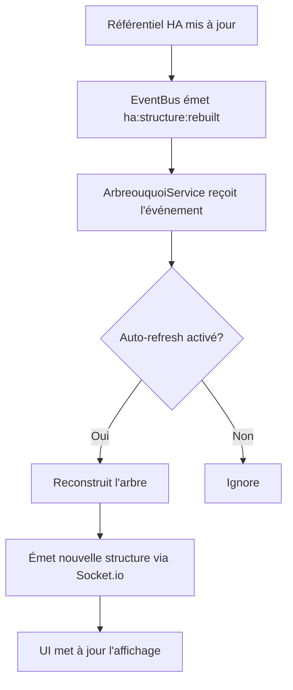
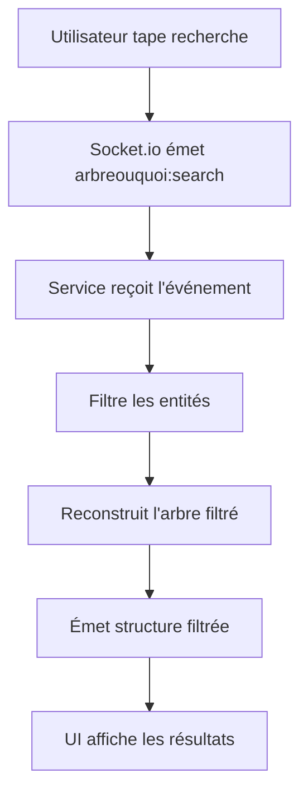
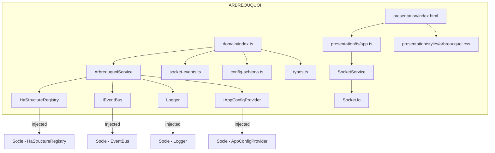
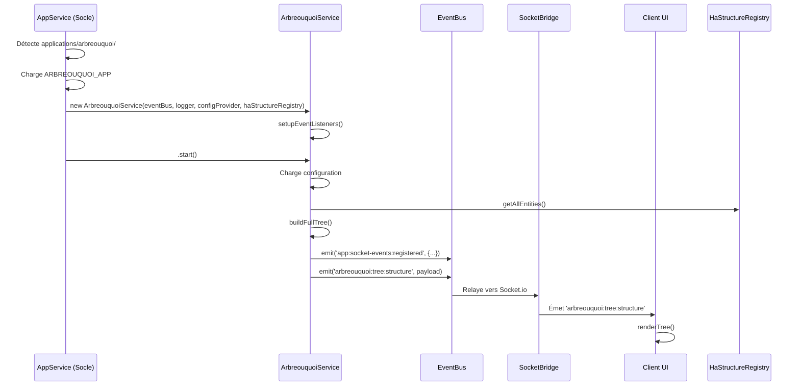
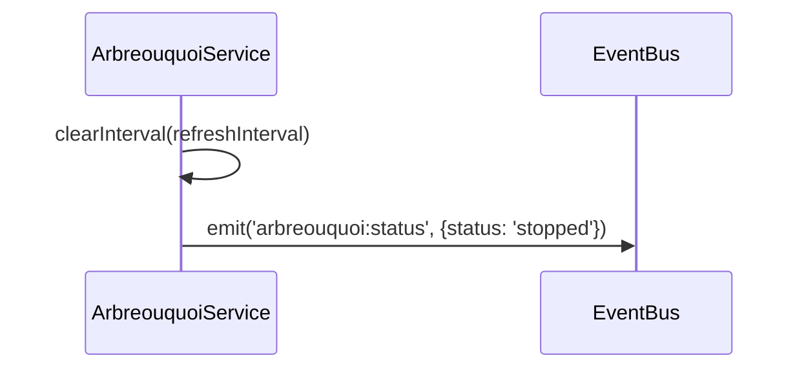
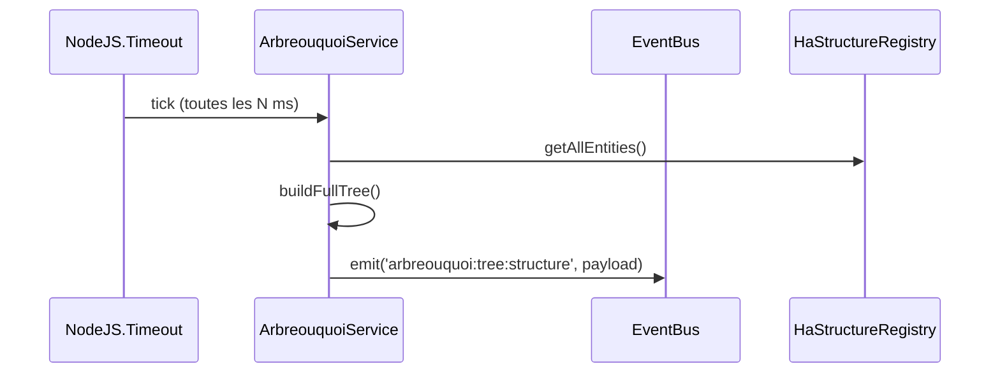

# Spécifications — Application ARBREOUQUOI

**Version :** 2.0
**Date :** 19 Septembre 2026
**Auteur :** Mistral Vibe / Claude
**Statut :** En développement
**Type :** Application standalone
**Dépend de :** `techniques-socle-ha-mqtt_specs_v4.33.md`, `guide-nouvelle-application_specs_v2.0.md`, `nommage_specs_v1.0.md`

> **v2.0 (19/09/2026)** — **Fusion de `fonctionnelles-arbreouquoi_specs_v1.5.md` +
> `implementation-arbreouquoi_specs_v1.4.md`** en un seul document (demande explicite utilisateur :
> "il y a plusieurs specs qui traitent de... pareil pour arbreouquoi... il faudra bien les séparer"
> — fonctionnel et technique restent clairement séparés en deux parties de CE document, plus deux
> fichiers distincts à maintenir en cohérence). Les deux anciens documents avaient chacun, en
> doublon, une section "Communication Inter-Applications" massive (~340 lignes chacune) décrivant
> `InterAppClient`/`ApplicationCapabilities`/des capacités jamais implémentées pour cette
> application — retirée, remplacée par un court pointeur unique en fin de document (voir
> `techniques-socle-ha-mqtt_specs` §9bis pour le mécanisme réel). Anciennes versions archivées.

---

## 📚 Table des Matières

**Partie 1 — Fonctionnel**
1. [Contexte et Objectifs](#1-contexte-et-objectifs)
2. [Fonctionnalités Principales](#2-fonctionnalités-principales)
3. [Cas d'Usage](#3-cas-dusage)
4. [Exigences Fonctionnelles](#4-exigences-fonctionnelles)
5. [Flux de Données](#5-flux-de-données)
6. [Interfaces Utilisateur](#6-interfaces-utilisateur)
7. [Règles Métier](#7-règles-métier)
8. [Contraintes](#8-contraintes)
9. [Évolutions Futures](#9-évolutions-futures)

**Partie 2 — Technique / Implémentation**
- T1. [Architecture de l'Application](#t1-architecture-de-lapplication)
- T2. [Structure des Fichiers](#t2-structure-des-fichiers)
- T3. [Détails des Composants](#t3-détails-des-composants)
- T4. [Cycle de Vie](#t4-cycle-de-vie)
- T5. [Communication](#t5-communication)
- T6. [Gestion des Données](#t6-gestion-des-données)
- T7. [Gestion des Erreurs](#t7-gestion-des-erreurs)
- T8. [Configuration](#t8-configuration)
- T9. [Build et Déploiement](#t9-build-et-déploiement)
- T10. [Tests](#t10-tests)

**[Communication Inter-Applications](#communication-inter-applications)** (partagé, fin de document)

---

# Partie 1 — Fonctionnel

## 1. Contexte et Objectifs

### 1.1 Contexte

L'application **ARBREOUQUOI** (Arbre Ou Quoi) s'intègre dans l'écosystème **dimotic-ha** (anciennement `ws-ha`, renommé le 04/08/2026) qui fournit un socle technique pour les applications Home Assistant. Le socle maintient déjà un **référentiel structuré** des entités Home Assistant organisé selon la hiérarchie :

```
Area (Lieu/Pièce) → QUOI (Type fonctionnel) → Entités
```

Ce référentiel est alimenté par les webservices via MQTT Discovery et la synchronisation WebSocket avec Home Assistant.

### 1.2 Objectifs

L'objectif principal de **ARBREOUQUOI** est de fournir une **visualisation interactive et intuitive** de ce référentiel, permettant aux utilisateurs de :

- **Comprendre** la structure hiérarchique de leurs entités Home Assistant
- **Naviguer** facilement dans l'arborescence Area → QUOI → Entités
- **Rechercher** des entités par divers critères
- **Filtrer** l'affichage selon leurs besoins
- **Explorer** les détails de chaque entité
- **Identifier** les relations entre entités (même pièce, même type, même appareil)

### 1.3 Public Cible

- **Utilisateurs finaux** : Propriétaires de maisons intelligentes souhaitant comprendre leur installation
- **Développeurs** : Créateurs d'applications ou d'automatisations ayant besoin de visualiser la structure
- **Administrateurs** : Personnes gérant plusieurs instances Home Assistant

---

## 2. Fonctionnalités Principales

### 2.1 Visualisation Hiérarchique

| Fonctionnalité | Description | Priorité |
|---------------|-------------|----------|
| **Arbre Area** | Affichage de toutes les pièces (Areas) avec comptage des entités | ⭐⭐⭐ |
| **Groupes QUOI** | Pour chaque Area, regroupement des entités par leur classification QUOI | ⭐⭐⭐ |
| **Liste Entités** | Affichage des entités avec leur état, domaine, et informations | ⭐⭐⭐ |
| **Entités Non Assignées** | Section dédiée aux entités sans Area assignée | ⭐⭐ |

### 2.2 Navigation et Interaction

| Fonctionnalité | Description | Priorité |
|---------------|-------------|----------|
| **Expand/Collapse** | Développement/réduction des sections et groupes | ⭐⭐⭐ |
| **Expand All / Collapse All** | Actions globales pour tout développer/rétracter | ⭐⭐ |
| **Clique sur Entité** | Affichage des détails de l'entité | ⭐⭐⭐ |
| **Survol Entité** | Surbrillance visuelle | ⭐⭐ |

### 2.3 Recherche et Filtrage

| Fonctionnalité | Description | Priorité |
|---------------|-------------|----------|
| **Recherche globale** | Recherche dans noms, IDs, pièces, types QUOI | ⭐⭐⭐ |
| **Filtre par Area** | Filtrer pour n'afficher qu'une pièce spécifique | ⭐⭐⭐ |
| **Filtre par QUOI** | Filtrer pour n'afficher qu'un type d'entité | ⭐⭐⭐ |
| **Filtre Entités Actives** | Masquer les entités non disponibles | ⭐⭐ |
| **Réinitialisation** | Retirer tous les filtres | ⭐⭐ |

### 2.4 Statistiques et Métriques

| Fonctionnalité | Description | Priorité |
|---------------|-------------|----------|
| **Compteur Entités** | Nombre total d'entités | ⭐⭐⭐ |
| **Compteur Pièces** | Nombre total de Areas | ⭐⭐⭐ |
| **Compteur Appareils** | Nombre total de Devices | ⭐⭐ |
| **Compteur Types QUOI** | Nombre de classifications QUOI uniques | ⭐⭐ |
| **Compteur Non Assignés** | Nombre d'entités sans Area | ⭐⭐ |

### 2.5 Détails des Entités

| Fonctionnalité | Description | Priorité |
|---------------|-------------|----------|
| **Informations de base** | ID, nom, domaine, classe, état | ⭐⭐⭐ |
| **Localisation** | Area et Device associés | ⭐⭐⭐ |
| **Classification QUOI** | Tous les tags QUOI de l'entité | ⭐⭐⭐ |
| **Entités Associées** | Entités du même QUOI ou de la même Area | ⭐⭐ |
| **Attributs** | Tous les attributs de l'entité | ⭐ |

### 2.6 Configuration

| Fonctionnalité | Description | Priorité |
|---------------|-------------|----------|
| **Thème** | Choix entre clair, sombre, ou automatique | ⭐⭐ |
| **Affichage Compact** | Mode compact pour les grands écrans | ⭐ |
| **Afficher Masquer IDs** | Option pour afficher/masquer les IDs techniques | ⭐⭐ |
| **Rafraîchissement Auto** | Rafraîchissement automatique de l'arbre | ⭐⭐ |
| **Intervalle de Rafraîchissement** | Configuration de la période | ⭐⭐ |

---

## 3. Cas d'Usage

### 3.1 Cas d'Usage Principal : Exploration de l'Installation

**Acteur :** Utilisateur final
**Scénario :** Un utilisateur veut comprendre comment ses entités Home Assistant sont organisées

1. L'utilisateur accède à l'application ARBREOUQUOI
2. L'arbre complet s'affiche avec toutes les Areas
3. L'utilisateur voit les statistiques globales (nombre d'entités, pièces, etc.)
4. L'utilisateur développe une pièce (ex: Salon)
5. Les groupes QUOI s'affichent (ex: lumière, température, interrupteur)
6. L'utilisateur développe un groupe QUOI (ex: lumière)
7. La liste des entités de ce type dans le Salon s'affiche
8. L'utilisateur clique sur une entité pour voir ses détails

**Résultat :** L'utilisateur comprend la structure de son installation

### 3.2 Cas d'Usage : Recherche d'une Entité Spécifique

**Acteur :** Développeur
**Scénario :** Un développeur cherche un capteur de température spécifique

1. Le développeur utilise la barre de recherche
2. Il tape "température salon"
3. L'arbre se filtre pour afficher uniquement les résultats pertinents
4. Le capteur de température du salon apparaît
5. Le développeur clique dessus pour voir ses détails

**Résultat :** Le développeur trouve rapidement l'entité recherchée

### 3.3 Cas d'Usage : Audit de l'Installation

**Acteur :** Administrateur
**Scénario :** Un administrateur veut vérifier quelles pièces contiennent des entités non assignées

1. L'administrateur accède à ARBREOUQUOI
2. Il consulte la section "Non assignés"
3. Il voit la liste des entités sans Area
4. Il peut cliquer sur chaque entité pour voir ses détails
5. Il peut filtrer par type QUOI pour identifier les types problématiques

**Résultat :** L'administrateur identifie les entités à assigner

### 3.4 Cas d'Usage : Vérification de la Classification QUOI

**Acteur :** Intégrateur
**Scénario :** Un intégrateur veut vérifier que toutes les entités sont correctement classées

1. L'intégrateur accède à ARBREOUQUOI
2. Il consulte le catalogue QUOI dans la navigation
3. Il voit tous les types QUOI avec leur nombre d'entités
4. Il peut cliquer sur un type QUOI pour filtrer l'arbre
5. Il vérifie que les entités affichées correspondent bien au type

**Résultat :** L'intégrateur valide la classification

---

## 4. Exigences Fonctionnelles

### 4.1 Exigences de Données

| ID | Exigence | Description |
|----|----------|-------------|
| EF-001 | **Accès au Référentiel** | L'application DOIT accéder au référentiel HaStructureRegistry fourni par le socle |
| EF-002 | **Écoute des Mises à Jour** | L'application DOIT écouter les événements de mise à jour du référentiel |
| EF-003 | **Rafraîchissement Automatique** | L'application DOIT rafraîchir l'affichage lors des mises à jour du référentiel (si configuré) |
| EF-004 | **Persistance des Données** | L'application NE DOIT PAS stocker de données en base locale (tout vient du référentiel) |

### 4.2 Exigences d'Affichage

| ID | Exigence | Description |
|----|----------|-------------|
| EF-005 | **Hiérarchie Visuelle** | L'arbre DOIT afficher clairement la hiérarchie Area → QUOI → Entités |
| EF-006 | **Icônes QUOI** | Chaque type QUOI DOIT avoir une icône visuelle |
| EF-007 | **Couleurs par Domaine** | Les entités DOIVENT être colorées selon leur domaine HA |
| EF-008 | **Compteurs** | Chaque section DOIT afficher le nombre d'éléments qu'elle contient |
| EF-009 | **Statistiques Globales** | La barre de statistiques DOIT afficher les métriques principales |
| EF-010 | **Indicateur de Connexion** | Un indicateur DOIT montrer l'état de la connexion Socket.io |

### 4.3 Exigences d'Interaction

| ID | Exigence | Description |
|----|----------|-------------|
| EF-011 | **Navigation Clic** | Cliquer sur une entité DOIT afficher ses détails |
| EF-012 | **Expand/Collapse** | Cliquer sur un en-tête de section DOIT développer/rétracter son contenu |
| EF-013 | **Survol** | Survoler une entité DOIT la mettre en évidence |
| EF-014 | **Rafraîchissement Manuel** | Un bouton DOIT permettre de rafraîchir manuellement les données |

### 4.4 Exigences de Recherche et Filtrage

| ID | Exigence | Description |
|----|----------|-------------|
| EF-015 | **Recherche Globale** | La recherche DOIT s'appliquer sur tous les champs textuels |
| EF-016 | **Filtrage par Area** | Le filtre par pièce DOIT afficher uniquement les entités de cette pièce |
| EF-017 | **Filtrage par QUOI** | Le filtre par type DOIT afficher uniquement les entités de ce type |
| EF-018 | **Filtrage Cumulatif** | Les filtres DOIVENT être cumulatifs (Area + QUOI) |
| EF-019 | **Réinitialisation** | Un bouton DOIT permettre de réinitialiser tous les filtres |

### 4.5 Exigences de Performance

| ID | Exigence | Description |
|----|----------|-------------|
| EF-020 | **Temps de Chargement** | L'arbre DOIT s'afficher en moins de 1 seconde pour 1000 entités |
| EF-021 | **Rafraîchissement Léger** | Le rafraîchissement automatique NE DOIT PAS bloquer l'UI |
| EF-022 | **Pagination** | Pour plus de 50 entités par groupe, une pagination DOIT être disponible |

---

## 5. Flux de Données

### 5.1 Diagramme Global

```
┌─────────────────────────────────────────────────────────────────┐
│                        ARBREOUQUOI                               │
├─────────────────────────────────────────────────────────────────┤
│                                                                 │
│  ┌─────────────┐     ┌─────────────┐     ┌─────────────┐    │
│  │   Service   │────▶│   EventBus  │────▶│  Socket.io  │    │
│  │ Métier      │     │             │     │  (Bridge)    │    │
│  └─────────────┘     └─────────────┘     └─────────────┘    │
│          ▲                     │                    ▲           │
│          │                     │                    │           │
│  ┌───────┴───────┐     ┌───────┴───────┐     ┌──────┴─────┐ │
│  │ HaStructure    │     │ Événements    │     │    UI    │ │
│  │ Registry       │     │ Socket.io     │     │ (HTML/TS)│ │
│  │ (Injected)     │     │             │     │         │ │
│  └───────────────┘     └───────────────┘     └─────────┘ │
│                                                                 │
└─────────────────────────────────────────────────────────────────┘
```

### 5.2 Flux de Démarrage

```mermaid
graph TD
    A[AppService détecte ARBREOUQUOI] --> B[Instancie ArbreouquoiService]
    B --> C[Appel .start()]
    C --> D[Charge configuration]
    D --> E[Vérifie HaStructureRegistry]
    E --> F[Écoute événements EventBus]
    F --> G[Émet structure initiale via Socket.io]
    G --> H[Enregistre événements persistants]
    H --> I[Service prêt]
```

### 5.3 Flux de Rafraîchissement



### 5.4 Flux de Recherche



---

## 6. Interfaces Utilisateur

### 6.1 Page Principale

**Structure :**
```
┌─────────────────────────────────────────────────────────────────┐
│  🌳 Arbre Ou Quoi                                     [⚙️][×] │
│  Visualisation du référentiel HA organisé par Area → QUOI → Entités│
├─────────────────────────────────────────────────────────────────┤
│                                                                 │
│  [🔄 Rafraîchir] [↕ Tout étendre] [↕ Tout réduire]      [🔍_____]  │
│                                                                 │
│  [Toutes les pièces ▼] [Tous les types ▼] [Appliquer] [Réinitialiser]│
├─────────────────────────────────────────────────────────────────┤
│  📊 150 Entités  │  12 Pièces  │  25 Appareils  │  15 Types  │  ✅  │
├─────────────────────────────────────────────────────────────────┤
│                                                                 │
│  ┌─────────────────┐  ┌─────────────────────────────────────┐ │
│  │ 📁 Arborescence  │  │                                             │ │
│  │                 │  │  ▶ 📍 Salon (25)                             │ │
│  │ 🏷️ Légende QUOI │  │     ▼                                                │ │
│  │ 💡 8           │  │     ▶ 💡 lumière (5)                              │ │
│  │ 🌡️ 12          │  │        ▼                                       │ │
│  │ 🔘 3            │  │        light.salon_principal                   │ │
│  │ ...            │  │        light.lampe_murale                     │ │
│  │                 │  │        ...                                       │ │
│  │                 │  │     ▶ 🌡️ température (3)                        │ │
│  │                 │  │        ▼                                       │ │
│  │                 │  │        sensor.temperature_salon                │ │
│  │                 │  │        ...                                       │ │
│  │                 │  │     ▶ 🔌 prise (2)                                │ │
│  │                 │  │        ...                                       │ │
│  │                 │  │  ▶ 🏠 Cuisine (18)                            │ │
│  │                 │  │     ...                                       │ │
│  │                 │  │  ▶ 📦 Non assignés (3)                         │ │
│  │                 │  │     ...                                       │ │
│  └─────────────────┘  └─────────────────────────────────────┘ │
│                                                                 │
├─────────────────────────────────────────────────────────────────┤
│  Dernière mise à jour: 20/07/2026 10:00:00                          │
└─────────────────────────────────────────────────────────────────┘
```

### 6.2 Panneau de Détails

**Structure :**
```
┌─────────────────────────────────────────────────────────────────┐
│  ×                                                               │
│  ┌─────────────────────────────────────────────────────────────┐│
│  │  Capteur Température Salon                                  ││
│  │  [sensor] [temperature] [État: 21.5°C]                  ││
│  └─────────────────────────────────────────────────────────────┘│
│                                                                  │
│  📋 Informations de base                                         │
│  ┌─────────────────────┬─────────────────────┐               │
│  │ ID Entité           │ sensor.temperature_   │               │
│  │                     │ salon                │               │
│  │ Nom                │ Capteur Température    │               │
│  │ Domaine            │ sensor               │               │
│  │ Classe Appareil    │ temperature          │               │
│  │ État               │ 21.5                │               │
│  └─────────────────────┴─────────────────────┘               │
│                                                                  │
│  📍 Localisation                                                 │
│  ┌─────────────────────┬─────────────────────┐               │
│  │ Pièce (Area)        │ Salon               │               │
│  │ ID Area            │ area.salon          │               │
│  └─────────────────────┴─────────────────────┘               │
│                                                                  │
│  📍 Hiérarchie OÙ                                                │
│  🏠 maison [grand_pere] → 🏢 étage [pere] → 📍 chambre [lieu]    │
│  → 🎯 chevet droit [lieu_precis]                                 │
│                                                                  │
│  🏷️ Classification QUOI                                         │
│  [🌡️ température] [capteur]                                      │
│                                                                  │
│  🔗 Entités Associées (8)                                        │
│  ▶ sensor.temperature_cuisine                                   │
│  ▶ sensor.temperature_chambre                                    │
│  + 6 autres...                                                  │
│                                                                  │
│  📊 Attributs                                                   │
│  friendly_name: Capteur Température Salon                        │
│  unit_of_measurement: °C                                        │
│  ...                                                            │
└─────────────────────────────────────────────────────────────────┘
```

> **⭐ v1.3** : **Section "Hiérarchie OÙ" du panneau de détails** (ci-dessus), corrigée pour
> afficher les niveaux dans le bon ordre (grand_père → père → lieu → lieu précis) et avec le bon
> libellé de niveau à chaque segment — voir **Partie 2 §T6.2bis** pour le root cause (niveau
> autrefois déduit de la position dans le tableau, devenu ambigu/faux dès qu'un segment optionnel
> comme `lieu_precis` peut être absent). Panneau également corrigé pour s'afficher réellement dans
> une boîte visible (fond, ombre) — voir **Partie 2 §T3.8** pour le bug CSS Shadow DOM sous-jacent.

### 6.3 Légende QUOI

**Affichage :**
- Une barre latérale gauche affichant tous les types QUOI
- Chaque type est représenté par son icône
- Le nombre d'entités pour chaque type est affiché
- Cliquer sur un type filtre l'arbre pour n'afficher que ce type

> **⭐ v1.3** : **Légende OÙ affichée au-dessus de la Légende QUOI** (demande utilisateur, nombre de
> niveaux OÙ fixe — 4 — contrairement au nombre de types QUOI qui varie). **ID technique de
> l'entité** (ex: `binary_sensor.chambre_bouton_...`) retiré de l'affichage sous chaque entité dans
> la liste (n'apportait rien d'utile en usage courant, `showEntityIds` supprimé).
>
> **⭐ v1.4 (15/08/2026)** : **libellé du QUOI toujours affiché à côté de l'icône**, y compris
> quand l'icône est reconnue — la v1.3 ne l'affichait qu'en repli pour les types sans icône dédiée
> (`❓` dans `getQuoiIcon()`), contrairement à la demande initiale du 08/08/2026 qui voulait le
> libellé visible dans tous les cas, pas seulement en dépannage.

---

## 7. Règles Métier

### 7.1 Règles de Tri

| Entité | Tri par défaut | Ordre |
|--------|---------------|-------|
| Areas | Nombre d'entités | Décroissant |
| Groupes QUOI | Nombre d'entités | Décroissant |
| Entités | Nom | Alphabétique |

### 7.2 Règles d'Affichage

| Condition | Affichage |
|-----------|----------|
| Entité disponible | Afficher l'état normalement |
| Entité unavailable | Afficher "N/A" en gris |
| Entité sans nom friendly | Afficher l'entity_id |
| Area sans entités | Masquer la section |
| QUOI sans entités | Masquer le groupe |

### 7.3 Règles de Filtrage

| Condition | Comportement |
|-----------|--------------|
| Filtre Area + Filtre QUOI | Appliquer les deux (intersection) |
| Filtre Area seul | Afficher toutes les entités de cette Area |
| Filtre QUOI seul | Afficher toutes les entités de ce type |
| Filtre Entités Actives | Masquer les entités unavailable |

### 7.4 Règles de Rafraîchissement

| Événement | Action |
|-----------|--------|
| ha:structure:rebuilt | Rafraîchir l'arbre si auto-refresh activé |
| ha:entity:updated | Rafraîchir l'arbre si auto-refresh activé |
| Manuel (bouton) | Toujours rafraîchir |
| Intervalle configuré | Rafraîchir selon la période |

---

## 8. Contraintes

### 8.1 Contraintes Techniques

| ID | Contrainte | Description |
|----|------------|-------------|
| C-001 | **Dépendance Socle** | L'application DOIT utiliser HaStructureRegistry du socle |
| C-002 | **Pas de Base de Données** | L'application NE DOIT PAS utiliser de base de données propre |
| C-003 | **TypeScript Strict** | Le code DOIT être en TypeScript avec mode strict |
| C-004 | **Architecture 5 Couches** | L'application DOIT respecter l'architecture en couches |
| C-005 | **EventBus Uniquement** | Toute communication DOIT passer par EventBus |

### 8.2 Contraintes d'Intégration

| ID | Contrainte | Description |
|----|------------|-------------|
| C-006 | **Socket.io** | L'application DOIT utiliser Socket.io pour la communication client |
| C-007 | **Événements Prefixés** | Tous les événements DOIVENT être prefixés par "arbreouquoi:" |
| C-008 | **Démarrage Automatique** | L'application DOIT démarrer automatiquement avec le socle |
| C-009 | **Configuration YAML** | La configuration DOIT être stockée dans data/arbreouquoi/config.yaml |

### 8.3 Contraintes de Sécurité

| ID | Contrainte | Description |
|----|------------|-------------|
| C-010 | **Pas d'Accès Direct MQTT** | L'application NE DOIT PAS accéder directement au client MQTT |
| C-011 | **Validation des Entrées** | Toutes les entrées utilisateur DOIVENT être validées |
| C-012 | **Échappement HTML** | Toutes les sorties HTML DOIVENT être échappées |

---

## 9. Évolutions Futures

### 9.1 Version 1.1

- **Export/Import** : Permettre d'exporter la structure en JSON ou CSV
- **Impression** : Ajouter une fonction d'impression de l'arbre
- **Graphique** : Visualisation sous forme de graphe (D3.js ou similar)
- **Historique** : Voir l'historique des changements du référentiel

### 9.2 Version 1.2

- **Édition** : Permettre de modifier les attributs QUOI directement
- **Création d'Areas** : Permettre de créer de nouvelles Areas depuis l'UI
- **Synchronisation** : Synchroniser les Areas entre HA et le référentiel
- **Multi-instances** : Supporter plusieurs instances HA

### 9.3 Version 2.0

- **Intégration MQTT** : Devenir une application d'intégration pour publier des entités
- **Gestion des Devices** : Afficher et gérer les appareils
- **Topologie Avancée** : Visualisation 3D ou géolocalisée
- **Collaboration** : Mode multi-utilisateurs avec annotations

---

# Partie 2 — Technique / Implémentation

## T1. Architecture de l'Application

### T1.1 Conformité à l'Architecture 5 Couches

L'application **ARBREOUQUOI** respecte strictement l'architecture en 5 couches définie dans `techniques-socle-ha-mqtt_specs` (voir dépendance en en-tête) :

```
┌─────────────────────────────────────────────────────────────────┐
│                    COUCHE PRÉSENTATION                             │
│  presentation/index.html                                          │
│  presentation/ts/app.ts                                           │
│  presentation/styles/arbreouquoi.css                             │
├─────────────────────────────────────────────────────────────────┤
│                    COUCHE APPLICATION                              │
│  → Gérée par le socle (AppService, EventBus, SocketBridge)       │
├─────────────────────────────────────────────────────────────────┤
│                    COUCHE MÉTIER                                  │
│  domain/ArbreouquoiService.ts                                     │
│  domain/index.ts (module + factory)                             │
│  domain/types.ts                                                 │
│  domain/socket-events.ts                                         │
│  domain/config-schema.ts                                        │
├─────────────────────────────────────────────────────────────────┤
│                     COUCHE HA                                     │
│  → Utilise HaStructureRegistry injecté par le socle             │
│  → Écoute les événements ha:structure:rebuilt, ha:entity:updated  │
├─────────────────────────────────────────────────────────────────┤
│               COUCHE INFRASTRUCTURE                              │
│  → Utilise IAppConfigProvider injecté par le socle              │
│  → Utilise Logger injecté par le socle                           │
└─────────────────────────────────────────────────────────────────┘
```

### T1.2 Diagramme de Composants



### T1.3 Injection de Dépendances

L'application utilise l'**injection de dépendances** via les factories :

```typescript
// Factory principale (recommandée)
export function createArbreouquoiService(
  eventBus: IEventBus,
  logger: Logger,
  configProvider: IAppConfigProvider<ArbreouquoiConfig>
): ArbreouquoiService {
  // HaStructureRegistry est injecté via AppService
  return new ArbreouquoiService(eventBus, logger, configProvider, haStructureRegistry);
}
```

**Flux d'injection :**
1. `AppService` détecte le module `arbreouquoi`
2. `AppService` charge `{NOM_APP}_APP` (ARBREOUQUOI_APP)
3. `AppService` recherche une factory `create{Arbreouquoi}Service`
4. `AppService` injecte : EventBus, Logger, IAppConfigProvider, HaStructureRegistry
5. `AppService` appelle `.start()` sur l'instance

---

## T2. Structure des Fichiers

### T2.1 Arborescence Complète

```bash
applications/
└── arbreouquoi/                    # ⭐ Répertoire de l'application
    ├── src/                        # ⭐ Source TypeScript
    │   ├── domain/                # Couche Métier
    │   │   ├── index.ts           # ⭐ OBLIGATOIRE : Déclaration du module + exports
    │   │   ├── ArbreouquoiService.ts   # ⭐ OBLIGATOIRE : Service métier
    │   │   ├── socket-events.ts    # Événements Socket.io spécifiques
    │   │   ├── config-schema.ts   # Schema de configuration (Zod)
    │   │   └── types.ts           # Types TypeScript spécifiques
    │   │
    │   └── presentation/           # Couche Présentation
    │       ├── index.html         # ⭐ OBLIGATOIRE : UI de l'application
    │       ├── ts/
    │       │   └── app.ts          # Logique frontend (TypeScript)
    │       └── styles/
    │           └── arbreouquoi.css # Styles spécifiques
    │
    └── dist/                       # ⭐ Répertoire de compilation (généré par tsc)
        ├── domain/
        │   ├── index.js
        │   ├── ArbreouquoiService.js
        │   └── ...
        └── presentation/
            └── ts/
                └── app.js
```

### T2.2 Fichiers et Rôles

| Fichier | Rôle | Obligatoire | Modifiable |
|---------|------|-------------|------------|
| `src/domain/index.ts` | Déclaration du module, métadonnées UI, exports | ✅ Oui | ❌ Non (structure) |
| `src/domain/ArbreouquoiService.ts` | Service métier principal | ✅ Oui | ✅ Oui |
| `src/domain/socket-events.ts` | Définition des événements Socket.io | ❌ Non | ✅ Oui |
| `src/domain/config-schema.ts` | Schema Zod pour la configuration | ❌ Non | ✅ Oui |
| `src/domain/types.ts` | Types TypeScript spécifiques | ❌ Non | ✅ Oui |
| `src/presentation/index.html` | Interface utilisateur principale | ✅ Oui | ✅ Oui |
| `src/presentation/ts/app.ts` | Logique client Socket.io | ❌ Non | ✅ Oui |
| `src/presentation/styles/arbreouquoi.css` | Styles CSS | ❌ Non | ✅ Oui |
| `dist/` | Répertoire de compilation (généré par tsc) | ❌ Non (généré) | ❌ Non |

---

## T3. Détails des Composants

### T3.1 domain/index.ts

**Rôle :** Point d'entrée du module, déclaration pour la détection automatique.

**Contenu obligatoire :**
- `ARBREOUQUOI_APP: ApplicationModule` — Métadonnées du module
- Export des composants : Service, socket-events, config-schema, types
- Factory : `createArbreouquoiService`

**Structure :**
```typescript
export const ARBREOUQUOI_APP: ApplicationModule = {
  id: 'arbreouquoi',           // ⚠️ Doit correspondre au nom du répertoire
  name: 'Arbre Ou Quoi',
  description: 'Visualisation du référentiel HA',
  icon: '🌳',
  type: 'standalone',           // 'integration' | 'standalone' | 'core'
  configurable: true,
  requiredMqtt: false,        // Pas besoin de MQTT direct (utilise EventBus)
  requiredHaWs: true,          // A besoin de la connexion HA WebSocket
  socketEvents: ARBREOUQUOI_SOCKET_EVENTS,
  configUi: ARBREOUQUOI_UI_METADATA,
  configSection: 'arbreouquoi' // Nom de la section dans config.yaml
};

export function createArbreouquoiService(eventBus, logger, configProvider) {
  return new ArbreouquoiService(eventBus, logger, configProvider, haStructureRegistry);
}

export * from './ArbreouquoiService';
export * from './socket-events';
export * from './config-schema';
export * from './types';
```

### T3.2 domain/ArbreouquoiService.ts

**Rôle :** Service métier principal qui gère la logique de l'application.

**Responsabilités :**
- Gestion du cycle de vie (start, stop)
- Construction de la structure d'arbre à partir du référentiel HA
- Émission des événements Socket.io
- Gestion des filtres et recherches
- Rafraîchissement automatique
- Gestion de la configuration

**Méthodes principales :**

| Méthode | Visibilité | Description |
|---------|------------|-------------|
| `start()` | public | ⭐ OBLIGATOIRE — Démarrage du service |
| `stop()` | public | OPTIONNEL — Arrêt propre du service |
| `setupEventListeners()` | private | Configuration des écouteurs EventBus |
| `buildFullTree()` | private | Construit la structure complète de l'arbre |
| `buildQuoiCatalog()` | private | Construit le catalogue QUOI avec compteurs |
| `emitFullTree()` | private | Émet la structure complète vers l'UI |
| `emitCatalog()` | private | Émet le catalogue QUOI vers l'UI |
| `emitStats()` | private | Émet les statistiques globales |
| `emitFilteredTree()` | private | Émet l'arbre filtré |
| `emitEntityDetails()` | private | Émet les détails d'une entité |
| `startAutoRefresh()` | private | Démarre le rafraîchissement automatique |

**Injections de dépendances :**
- `IEventBus` — Pour communiquer avec Socket.io via EventBus
- `Logger` — Pour le logging
- `IAppConfigProvider<ArbreouquoiConfig>` — Pour accéder à la configuration spécifique
- `HaStructureRegistry` — **Injection principale** — Pour accéder au référentiel HA

### T3.3 domain/socket-events.ts

**Rôle :** Définition centralisée de tous les événements Socket.io de l'application.

**Conventions :**
- Tous les événements DOIVENT être prefixés par `arbreouquoi:`
- Séparation Server → Client et Client → Server
- Utilisation de `as const` pour le typage TypeScript

**Événements définis :**

**Server → Client :**
- `arbreouquoi:tree:structure` — Structure complète de l'arbre
- `arbreouquoi:tree:updated` — Mise à jour de l'arbre
- `arbreouquoi:quoi:catalog` — Catalogue QUOI avec compteurs
- `arbreouquoi:areas:list` — Liste des Areas
- `arbreouquoi:devices:list` — Liste des Devices
- `arbreouquoi:entity:details` — Détails d'une entité
- `arbreouquoi:entities:by-area` — Entités filtrées par Area
- `arbreouquoi:entities:by-quoi` — Entités filtrées par QUOI
- `arbreouquoi:stats` — Statistiques globales
- `arbreouquoi:status` — Statut de l'application
- `arbreouquoi:error` — Erreur

**Client → Server :**
- `arbreouquoi:tree:get` — Demande la structure initiale
- `arbreouquoi:catalog:get` — Demande le catalogue QUOI
- `arbreouquoi:entity:get` — Demande les détails d'une entité
- `arbreouquoi:search` — Recherche globale
- `arbreouquoi:filter:set` — Applique des filtres
- `arbreouquoi:filter:reset` — Réinitialise les filtres
- `arbreouquoi:refresh` — Rafraîchissement manuel
- `arbreouquoi:config:get` — Demande la configuration
- `arbreouquoi:config:save` — Sauvegarde la configuration

### T3.4 domain/config-schema.ts

**Rôle :** Définition du schema de configuration avec Zod.

**Structure :**
```typescript
import { z } from 'zod';

export const arbreouquoiConfigSchema = z.object({
  enabled: z.boolean().default(true),
  display: z.object({
    expandAll: z.boolean().default(false),
    showEntityIds: z.boolean().default(true),
    showDeviceInfo: z.boolean().default(true),
    showQuoiIcons: z.boolean().default(true),
    theme: z.enum(['light', 'dark', 'auto']).default('auto'),
    compactMode: z.boolean().default(false)
  }).default({}),
  filters: z.object({
    defaultAreaId: z.string().optional(),
    defaultQuoiId: z.string().optional(),
    showOnlyActive: z.boolean().default(true)
  }).default({}),
  refresh: z.object({
    autoRefreshEnabled: z.boolean().default(true),
    autoRefreshInterval: z.number().min(1000).max(300000).default(30000),
    refreshOnHaUpdate: z.boolean().default(true)
  }).default({}),
  advanced: z.object({
    maxDepth: z.number().min(1).max(10).default(5),
    showUnassigned: z.boolean().default(true),
    groupByDevice: z.boolean().default(false),
    enableSearch: z.boolean().default(true)
  }).default({})
});

export type ArbreouquoiConfig = z.infer<typeof arbreouquoiConfigSchema>;
```

### T3.5 domain/types.ts

**Rôle :** Définition des types TypeScript spécifiques à l'application.

**Interfaces principales :**

```typescript
// Structure de l'arbre
interface AreaTreeNode {
  area: HaArea;
  children: QuoiGroup[];
  entityCount: number;
}

interface QuoiGroup {
  quoi: HaQuoiDefinition;
  entities: HaStructuredEntity[];
  count: number;
}

interface FullTreeStructure {
  areas: AreaTreeNode[];
  unassigned: EntityTreeNode[];
  totalEntities: number;
  totalAreas: number;
  totalQuoiTypes: number;
}

// Catalogue avec compteurs
interface QuoiCatalogWithCounts {
  quoi: HaQuoiDefinition;
  entityCount: number;
  areas: string[];
}

// Filtrage
interface FilterOptions {
  areaId?: string;
  quoiId?: string;
  showOnlyActive?: boolean;
  sortBy?: 'name' | 'entityCount' | 'quoi';
  sortOrder?: 'asc' | 'desc';
}

// Payloads Socket.io
interface ArbreOuQuoiTreePayload {
  tree: FullTreeStructure;
  catalog: QuoiCatalogWithCounts[];
  areas: HaArea[];
  timestamp: string;
}
```

> **⭐ v1.3** : Ce bloc reste daté (structure Area à un seul niveau — voir note §T6.2bis) ; une
> interface bien réelle et actuelle, `ArbreOuQuoiEntityDetailsPayload.ouPath`, a changé cette
> session : `string[]` → `Array<{ name: string; level: 'grand_pere' | 'pere' | 'lieu' |
> 'lieu_precis' }>` (voir §T6.2bis pour le pourquoi — `extractOuSegments()`).

### T3.6 presentation/index.html

**Rôle :** Interface utilisateur principale de l'application.

**Structure :**
```html
<!DOCTYPE html>
<html>
<head>
  <meta charset="UTF-8">
  <title>Arbre Ou Quoi</title>
  <link rel="stylesheet" href="/styles/main.css">
  <link rel="stylesheet" href="/applications/arbreouquoi/styles/arbreouquoi.css">
  <!-- Derniere modification: AAAA-MM-JJ HH:MM:SS - Description -->
</head>
<body>
  <div class="app-container">
    <!-- Header -->
    <header class="app-header">...</header>

    <!-- Toolbar -->
    <div class="app-toolbar">...</div>

    <!-- Stats Bar -->
    <div class="stats-bar">...</div>

    <!-- Loading -->
    <div class="loading-indicator">...</div>

    <!-- Error -->
    <div class="error-message">...</div>

    <!-- Main Content -->
    <div class="main-content">
      <div class="tree-container">...
      </div>
      <div class="details-panel">...</div>
    </div>

    <!-- Footer -->
    <div class="app-footer">...</div>
  </div>

  <script src="/applications/arbreouquoi/ts/app.js"></script>
</body>
</html>
```

**Sections principales :**
1. **Header** — Titre et description
2. **Toolbar** — Boutons d'action, recherche, filtres
3. **Stats Bar** — Statistiques globales et statut de connexion
4. **Main Content** — Arborescence et panneaux
5. **Footer** — Information de dernière mise à jour

### T3.7 presentation/ts/app.ts

**Rôle :** Logique client Socket.io pour l'interface utilisateur.

**Responsabilités :**
- Connexion à Socket.io via `SocketService`
- Écoutes des événements serveur
- Gestion de l'état local
- Manipulation du DOM pour l'affichage
- Émission des événements utilisateur vers le serveur

**Fonctions principales :**

| Fonction | Rôle |
|----------|------|
| `initEventListeners()` | Configuration des écouteurs Socket.io et UI |
| `initUI()` | Initialisation de l'interface |
| `updateConnectionStatus()` | Met à jour l'indicateur de connexion |
| `showLoading()` / `hideLoading()` | Affiche/masque l'indicateur de chargement |
| `showError()` / `hideError()` | Gestion des messages d'erreur |
| `renderTree()` | Rend l'arbre complet |
| `renderUnassignedEntities()` | Rend les entités non assignées |
| `renderQuoiGroups()` | Rend les groupes QUOI |
| `renderEntity()` | Rend une entité individuelle |
| `renderQuoiCatalog()` | Rend le catalogue QUOI |
| `renderEntityDetails()` | Rend les détails d'une entité |
| `populateFilters()` | Remplit les menus déroulants de filtres |
| `updateStats()` | Met à jour les statistiques |

**État global :**
```typescript
let state = {
  tree: null as FullTreeStructure | null,
  catalog: [] as QuoiCatalogWithCounts[],
  areas: [] as HaArea[],
  isConnected: false,
  isLoading: true,
  error: null as string | null,
  filters: {
    areaId: '',
    quoiId: '',
    showOnlyActive: true
  },
  displayConfig: {
    expandAll: false,
    showEntityIds: true,
    showDeviceInfo: true,
    showQuoiIcons: true
  }
};
```

### T3.8 presentation/styles/arbreouquoi.css

**Rôle :** Styles CSS spécifiques à l'application.

**Organisation :**
- Variables CSS pour la thématisation
- Styles par composant (header, toolbar, stats, tree, etc.)
- Styles responsive pour mobile/tablette
- Support du thème sombre

**Classes principales :**
- `.app-container` — Conteneur principal
- `.app-header` — En-tête
- `.app-toolbar` — Barre d'outils
- `.stats-bar` — Barre de statistiques
- `.tree-container` — Conteneur de l'arbre
- `.tree-navigation` — Navigation latérale
- `.tree-content` — Contenu de l'arbre
- `.tree-section` — Section de l'arbre (Area)
- `.section-header` — En-tête de section
- `.section-content` — Contenu de section
- `.quoi-group` — Groupe QUOI
- `.quoi-header` — En-tête de groupe QUOI
- `.entity-item` — Éléments d'entité
- `.details-panel` — Panneau de détails
- `.error-message` — Message d'erreur

> **⭐ v1.3 — Bug réel : `:root` ne s'applique jamais dans le Shadow DOM.** Cette feuille est
> chargée via `<link>` à l'intérieur de Shadow DOM (`app-module-container`, et une seconde fois
> par chaque `<tree-node>` dans son propre shadow — voir `tree-node.ts`) : un bloc `:root { ... }`
> cible toujours le vrai `<html>` du document, jamais atteignable depuis l'intérieur d'un shadow
> root — **toutes** les variables CSS qui y étaient définies ne s'appliquaient donc nulle part,
> silencieusement (`var(--xxx)` non résolu = valeur initiale : `0px`/transparent pour la plupart
> des propriétés concernées ici). Symptômes observés en direct : `.details-panel` sans fond ni
> ombre (illisible, superposé au reste de la page), décalage progressif entre niveaux OÙ invisible
> — pas seulement les symptômes précisément rapportés, silencieusement TOUTE la thématisation par
> variable CSS de l'application. **Fix** : `:root, :host { ... }` — `:host` cible correctement
> l'élément hôte de chaque shadow où la feuille est chargée, les variables héritent alors
> normalement vers tous les descendants (y compris les shadow roots imbriqués plus profondément,
> `tree-node` dans `app-module-container`). Palette par défaut fixée sombre (alignée sur le shell,
> `ui/styles/main.css`, lui-même sombre de façon inconditionnelle sans lien avec
> `prefers-color-scheme` du navigateur) — une bascule `@media (prefers-color-scheme: light)` a été
> testée puis écartée : sur le poste de développement `prefers-color-scheme` valait déjà `light`
> alors que le shell reste visuellement sombre partout, ce qui aurait rendu ce module clair en
> permanence pendant que le reste de l'appli reste sombre.

---

## T4. Cycle de Vie

### T4.1 Démarrage

**Séquence :**



### T4.2 Arrêt

**Séquence :**



### T4.3 Rafraîchissement Automatique

**Séquence :**



---

## T5. Communication

### T5.1 Événements Socket.io

Voir `socket-events.ts` de l'application pour la liste complète (§T3.3 ci-dessus).

**Événements Persistants :**
Les événements suivants sont enregistrés comme persistants et envoyés automatiquement aux nouveaux clients :
- `arbreouquoi:tree:structure`
- `arbreouquoi:quoi:catalog`
- `arbreouquoi:areas:list`
- `arbreouquoi:stats`
- `arbreouquoi:status`

**Avantage :** Les nouveaux clients reçoivent immédiatement l'état actuel sans avoir à le demander.

### T5.2 Événements EventBus

**Écoutés par ArbreouquoiService :**

| Événement | Source | Action |
|-----------|--------|--------|
| `ha:structure:rebuilt` | Socle | Rafraîchit l'arbre (si configuré) |
| `ha:entity:updated` | Socle | Rafraîchit l'arbre (si configuré) |
| `ha:area:updated` | Socle | Met à jour les Areas |
| `arbreouquoi:tree:get` | Client | Émet la structure actuelle |
| `arbreouquoi:catalog:get` | Client | Émet le catalogue QUOI |
| `arbreouquoi:refresh` | Client | Rafraîchit toutes les données |
| `arbreouquoi:filter:set` | Client | Applique les filtres et émet l'arbre filtré |
| `arbreouquoi:filter:reset` | Client | Réinitialise les filtres |
| `arbreouquoi:search` | Client | Effectue une recherche |
| `arbreouquoi:entity:get` | Client | Émet les détails d'une entité |
| `arbreouquoi:config:get` | Client | Émet la configuration actuelle |
| `arbreouquoi:config:save` | Client | Sauvegarde la configuration |

**Émis par ArbreouquoiService :**

| Événement | Destination | Données |
|-----------|-------------|--------|
| `arbreouquoi:tree:structure` | Client | Structure complète de l'arbre |
| `arbreouquoi:tree:updated` | Client | Structure mise à jour |
| `arbreouquoi:quoi:catalog` | Client | Catalogue QUOI |
| `arbreouquoi:areas:list` | Client | Liste des Areas |
| `arbreouquoi:stats` | Client | Statistiques globales |
| `arbreouquoi:status` | Client | Statut de l'application |
| `arbreouquoi:error` | Client | Message d'erreur |
| `arbreouquoi:entity:details` | Client | Détails d'une entité |
| `app:socket-events:registered` | SocketBridge | Enregistrement des événements persistants |

### T5.3 Communication avec le Socle

L'application **n'accède pas directement** à :
- `ConfigService` — Utilise `IAppConfigProvider` injecté
- `HaMqttIntegrationService` — Utilise EventBus pour les commandes MQTT
- `HaWsClient` — Utilise EventBus pour les commandes HA
- `fs` (filesystem) — Pas d'accès direct aux fichiers

Toute la communication avec le socle passe par :
- **EventBus** — Pour les événements internes
- **IAppConfigProvider** — Pour la configuration
- **Logger** — Pour le logging
- **HaStructureRegistry** — Pour le référentiel HA

---

## T6. Gestion des Données

### T6.1 Source de Données

**Source unique :** `HaStructureRegistry` (injecté par le socle)

**Méthodes utilisées :**

| Méthode | Retourne | Utilisation |
|---------|----------|-------------|
| `getAllEntities()` | `HaStructuredEntity[]` | Récupère toutes les entités |
| `getEntity(entityId)` | `HaStructuredEntity \| undefined` | Récupère une entité spécifique |
| `getAreas()` | `Map<string, HaArea>` | Récupère toutes les Areas |
| `getArea(areaId)` | `HaArea \| undefined` | Récupère une Area spécifique |
| `getDevices()` | `Map<string, HaDevice>` | Récupère tous les Devices |
| `getDevice(deviceId)` | `HaDevice \| undefined` | Récupère un Device spécifique |
| `getQuoiCatalog()` | `HaQuoiDefinition[]` | Récupère le catalogue QUOI |
| `getEntitiesByArea(areaId)` | `HaStructuredEntity[]` | Entités d'une Area |
| `getEntitiesByQuoi(quoiId)` | `HaStructuredEntity[]` | Entités d'un type QUOI |
| `getEntitiesByAreaAndQuoi(areaId, quoiId)` | `HaStructuredEntity[]` | Entités d'une Area ET d'un type QUOI |

### T6.2 Transformation des Données

**De HaStructureRegistry → FullTreeStructure :**

```typescript
// 1. Récupérer toutes les données
const areasMap = haStructureRegistry.getAreas();
const allEntities = haStructureRegistry.getAllEntities();
const catalog = haStructureRegistry.getQuoiCatalog();

// 2. Construire les nœuds Area
const areaNodes = Array.from(areasMap.values()).map(area => {
  const areaEntities = allEntities.filter(e => e.area?.area_id === area.area_id);

  // 3. Grouper par QUOI
  const quoiGroupsMap = new Map<string, HaStructuredEntity[]>();
  for (const entity of areaEntities) {
    for (const quoiId of entity.quoi_ids) {
      if (!quoiGroupsMap.has(quoiId)) {
        quoiGroupsMap.set(quoiId, []);
      }
      quoiGroupsMap.get(quoiId)!.push(entity);
    }
  }

  // 4. Convertir en QuiGroup[]
  const quoiGroups = Array.from(quoiGroupsMap.entries()).map(([quoiId, entities]) => {
    const quoiDef = catalog.find(q => q.id === quoiId);
    return {
      quoi: quoiDef || { id: quoiId, name: quoiId, icon: '❓' },
      entities,
      count: entities.length
    };
  });

  return { area, children: quoiGroups, entityCount: areaEntities.length };
});

// 5. Trier et retourner
areaNodes.sort((a, b) => b.entityCount - a.entityCount);
```

### T6.2bis ⭐ v1.3 — `extractOuSegments()` : niveau OÙ tagué, pas déduit de la position

> Note : l'exemple §T6.2 ci-dessus décrit une hiérarchie Area à un seul niveau, antérieure à la
> hiérarchie OÙ à 4 niveaux (grand_père/père/lieu/lieu_précis) réellement implémentée — non
> réécrit ici (hors-scope au moment de l'écriture), voir **Partie 1 §6.1/§6.2**.

**Root cause corrigée** : l'ancien calcul (`getOuLevel(index, totalLength)`, côté serveur ET
dupliqué côté client dans `app.ts`) déduisait le niveau d'un segment **de sa position dans un
tableau de noms** (`extractOuPathFromEntity`/`extractOuNamesFromEntity`), en supposant un ordre
et une longueur fixes. Devenu **ambigu, pas seulement inversé**, dès qu'un segment optionnel
(`lieu_precis`, rendu `null` quand identique à `lieu` — voir `fonctionnelles-nommage_specs`) peut
être absent : un tableau de longueur 2 peut être `[lieu, pere]` ou `[pere, grand_pere]` selon les
segments réellement présents, la position seule ne suffit plus à savoir lequel.

**Fix** : `ArbreouquoiService.extractOuSegments(entity): OuSegment[]` remplace les deux anciennes
fonctions par une seule. Chaque segment lit directement le champ `attributs_taxonomie` qui lui
correspond (`slug_grand_pere`/`lieu_grand_pere`, `slug_pere`/`lieu_pere`, `slug_lieu`/
`lieu_principal`, `slug_precis`/`lieu_precis`) et pousse `{ id, name, level }` avec son niveau
**explicite**, dans l'ordre fixe grand_père → père → lieu → précis, en ignorant les champs
`null`. Plus aucune inférence par position, dans aucun des deux sens (construction de l'arbre ET
panneau de détails).

**Propagation côté payload** : `ArbreOuQuoiEntityDetailsPayload.ouPath` passe de `string[]` (noms
seuls) à `Array<{ name: string; level: 'grand_pere' | 'pere' | 'lieu' | 'lieu_precis' }>` — le
niveau voyage désormais avec le nom jusqu'au client, qui n'a plus besoin (et n'a plus le droit) de
le redéviner lui-même. `getLevelFromPathIndex()` côté client (`app.ts`), doublon exact du même bug
de position, supprimée. `EntityInfo.ouPath` (utilisé pour les entités **liées**, informatif
seulement, jamais affiché avec un niveau) reste `string[]` — pas concerné.

### T6.3 Cache

Aucun cache local n'est utilisé. Toutes les données sont :
- **Lues** depuis HaStructureRegistry à chaque requête
- **Transformées** à la volée
- **Envoyées** vers le client via Socket.io

Le client conserve un cache local dans son état (`state.tree`, `state.catalog`, etc.) pour une navigation fluide.

---

## T7. Gestion des Erreurs

### T7.1 Stratégie Globale

**Principe :** Ne jamais bloquer l'application, toujours fournir un feedback à l'utilisateur.

**Niveaux de gravité :**

| Niveau | Comportement | Logging | Notification Utilisateur |
|--------|--------------|---------|----------------------|
| Debug | Log pour développement | `logger.debug()` | ❌ Non |
| Info | Information normale | `logger.info()` | ❌ Non |
| Warning | Problème non bloquant | `logger.warn()` | ⚠️ Optionnel |
| Error | Erreur bloquante | `logger.error()` | ✅ Oui |

### T7.2 Gestion des Erreurs dans ArbreouquoiService

```typescript
// Dans start()
try {
  await this.initialize();
  this.emitStatus('ready', 'Service démarré');
} catch (error) {
  this.logger.error('ArbreouquoiService', `Erreur de démarrage: ${error}`);
  this.emitStatus('error', `Erreur de démarrage: ${error}`);
  throw error; // Permet à AppService de gérer l'erreur
}

// Dans les méthodes de traitement
try {
  const result = this.processData();
  this.emitResult(result);
} catch (error) {
  this.logger.error('ArbreouquoiService', `Erreur: ${error}`);
  this.eventBus.emit(ARBREOUQUOI_SOCKET_EVENTS.ERROR, {
    message: `Erreur: ${error}`
  });
}
```

### T7.3 Gestion des Erreurs côté Client

```typescript
// Connexion Socket.io
socket.on('connect_error', (error) => {
  showError(`Erreur de connexion: ${error.message}`);
  updateConnectionStatus('error');
});

socket.on('disconnect', () => {
  showError('Déconnecté. Reconnexion en cours...');
  updateConnectionStatus('disconnected');
});

// Erreurs de l'application
socket.on('arbreouquoi:error', (error) => {
  showError(error.message);
});
```

### T7.4 Scénarios d'Erreur

| Scénario | Cause | Gestion |
|----------|-------|---------|
| Référentiel HA vide | HA non connecté ou en cours de sync | Afficher message "Chargement en cours..." |
| Entité non trouvée | ID d'entité invalide | Émettre erreur vers client |
| Erreur de configuration | Schema Zod invalide | Logger.error + message utilisateur |
| Déconnexion Socket.io | Problème réseau | Afficher indicateur de déconnexion |
| Erreur EventBus | Channel inexistant | Logger.error (ne pas bloquer) |

---

## T8. Configuration

### T8.1 Structure de Configuration

**Fichier :** `data/arbreouquoi/config.yaml` (objet nu, ex-section `arbreouquoi` de l'ancien
fichier unique — voir `techniques-socle-ha-mqtt_specs` §7 ; le socle vit désormais dans
`data/core/config.yaml`, à part)

```yaml
enabled: true

# Options d'affichage
display:
  expandAll: false
  showEntityIds: true
  showDeviceInfo: true
  showQuoiIcons: true
  theme: auto  # light | dark | auto
  compactMode: false

# Filtres par défaut
filters:
  defaultAreaId: ""  # Optionnel
  defaultQuoiId: ""  # Optionnel
  showOnlyActive: true

# Options de rafraîchissement
refresh:
  autoRefreshEnabled: true
  autoRefreshInterval: 30000  # 30 secondes
  refreshOnHaUpdate: true

# Options avancées
advanced:
  maxDepth: 5
  showUnassigned: true
  groupByDevice: false
  enableSearch: true
```

### T8.2 Chargement de la Configuration

```typescript
// Dans ArbreouquoiService.start()
const config = this.configService.getAppConfig();

// Accès aux valeurs
config.display.theme;           // 'auto'
config.refresh.autoRefreshInterval; // 30000
config.filters.showOnlyActive;    // true
```

### T8.3 Sauvegarde de la Configuration

```typescript
// Depuis le client
socket.emit('arbreouquoi:config:save', {
  display: { theme: 'dark' },
  refresh: { autoRefreshInterval: 60000 }
});

// Dans ArbreouquoiService
this.configService.savePartialConfig({
  display: { theme: 'dark' }
});

// Cela déclenche automatiquement :
// 1. Sauvegarde dans data/arbreouquoi/config.yaml
// 2. Émission de 'app:module:config:saved' sur EventBus
// 3. Redémarrage automatique du service (si nécessaire)
```

---

## T9. Build et Déploiement

### T9.1 Prérequis

- Node.js 20+ (LTS)
- TypeScript 5.x
- pnpm (recommandé)
- Docker (pour le déploiement)

### T9.2 Installation

```bash
# Depuis la racine du projet
cd /chemin/vers/dimotic-ha

# Builder l'application (chaque app a son propre build, voir CLAUDE.md — pas de build racine fiable)
cd applications/arbreouquoi && npm run build
```

### T9.3 Déploiement

Voir `techniques-socle-ha-mqtt_specs` §11 (Docker) pour le mécanisme réel de build/déploiement de
l'image complète — le détail "docker-compose build/up" par app individuelle ci-dessous est un
raccourci de développement local, pas le mécanisme de production (image unique multi-apps).

**Mode 1 : Développement**
```bash
npm run dev
```

**Mode 2 : Production (Docker, image complète du projet)**
```bash
docker compose pull && docker compose up -d
```

### T9.4 Activation/Désactivation

Voir `guide-nouvelle-application_specs` §9 — liste `disabledApps` dans `data/core/config.yaml`,
**seul** interrupteur réel (le déplacement de répertoire `applications/` ↔
`applications_désactivées/` décrit historiquement ici n'est plus le mécanisme utilisé).

---

## T10. Tests

### T10.1 Checklist de Validation

**Avant déploiement :**

- [ ] `npm run build` passe sans erreur
- [ ] `npx tsc --noEmit` passe sans erreur TypeScript
- [ ] Le module apparaît dans les logs de démarrage d'AppService
- [ ] Le service démarre sans erreur (vérifier les logs)
- [ ] L'UI est accessible via `/applications/arbreouquoi/presentation/index.html`
- [ ] La structure de l'arbre s'affiche correctement
- [ ] Les statistiques sont mises à jour
- [ ] Le catalogue QUOI s'affiche
- [ ] Les filtres fonctionnent
- [ ] La recherche fonctionne
- [ ] Le clic sur une entité affiche ses détails
- [ ] Le rafraîchissement automatique fonctionne (si activé)
- [ ] La déconnexion/reconnexion Socket.io est gérée correctement
- [ ] Les erreurs sont affichées correctement

### T10.2 Tests Unitaires

**Fichier :** `applications/arbreouquoi/tests/ArbreouquoiService.test.ts`

```typescript
import { describe, it, expect, vi, beforeEach } from 'vitest';
import { ArbreouquoiService } from '../domain/ArbreouquoiService';
import type { IEventBus } from '../../../../application/IEventBus';
import type { Logger } from '../../../../infrastructure/logger/index';
import type { IAppConfigProvider } from '../../../../infrastructure/config/IAppConfigProvider';
import type { HaStructureRegistry } from '../../../../ha/types/ha-structure';

// Mock des dépendances
const mockEventBus = {
  on: vi.fn(),
  emit: vi.fn(),
  onGeneric: vi.fn()
} as unknown as IEventBus;

const mockLogger = {
  info: vi.fn(),
  error: vi.fn(),
  debug: vi.fn(),
  warn: vi.fn()
} as unknown as Logger;

const mockConfigProvider = {
  getAppConfig: vi.fn().mockReturnValue({
    enabled: true,
    display: {},
    filters: {},
    refresh: { autoRefreshEnabled: false },
    advanced: {}
  })
} as unknown as IAppConfigProvider;

const mockHaStructureRegistry = {
  getAllEntities: vi.fn().mockReturnValue([]),
  getAreas: vi.fn().mockReturnValue(new Map()),
  getDevices: vi.fn().mockReturnValue(new Map()),
  getQuoiCatalog: vi.fn().mockReturnValue([]),
  getEntity: vi.fn(),
  getEntitiesByArea: vi.fn(),
  getEntitiesByQuoi: vi.fn()
} as unknown as HaStructureRegistry;

describe('ArbreouquoiService', () => {
  let service: ArbreouquoiService;

  beforeEach(() => {
    service = new ArbreouquoiService(
      mockEventBus,
      mockLogger,
      mockConfigProvider,
      mockHaStructureRegistry
    );
    vi.clearAllMocks();
  });

  describe('start()', () => {
    it('should log startup message', async () => {
      await service.start();
      expect(mockLogger.info).toHaveBeenCalledWith(
        'ArbreouquoiService',
        expect.stringContaining('Démarrage')
      );
    });

    it('should emit status ready on success', async () => {
      await service.start();
      expect(mockEventBus.emit).toHaveBeenCalledWith(
        'arbreouquoi:status',
        expect.objectContaining({ status: 'ready' })
      );
    });
  });

  describe('buildFullTree()', () => {
    it('should handle empty registry', () => {
      mockHaStructureRegistry.getAllEntities.mockReturnValue([]);
      mockHaStructureRegistry.getAreas.mockReturnValue(new Map());

      const tree = service.buildFullTree();

      expect(tree.areas).toHaveLength(0);
      expect(tree.unassigned).toHaveLength(0);
      expect(tree.totalEntities).toBe(0);
    });
  });
});
```

### T10.3 Tests d'Intégration

**À tester :**
1. Communication Socket.io entre client et serveur
2. Intégration avec HaStructureRegistry
3. Gestion des événements EventBus
4. Persistance de la configuration
5. Détection automatique par AppService

### T10.4 Outils de Test

- **Vitest** — Tests unitaires TypeScript
- **Socket.io Client** — Test de la communication Socket.io
- **Navigateur** — Test manuel de l'UI

---

## Annexes

### A.1 Conventions de Nommage

Voir `nommage_specs_v1.0.md` pour les règles complètes.

**Rappel pour ARBREOUQUOI :**
- **Répertoire :** `arbreouquoi` (minuscules, sans espaces, sans caractères spéciaux)
- **Fichiers :** `ArbreouquoiService.ts` (PascalCase pour les classes)
- **Variables :** `arbreouquoiConfigSchema` (camelCase)
- **Constantes :** `ARBREOUQUOI_SOCKET_EVENTS` (UPPER_CASE)
- **Événements :** `arbreouquoi:tree:structure` (minuscules avec séparateurs :)

### A.2 Bonnes Pratiques

1. **Respecter l'architecture 5 couches** — Ne jamais mélanger les couches
2. **Utiliser les interfaces** — Toujours typer les données
3. **Logger systématiquement** — Info pour les actions, Error pour les erreurs
4. **Valider les entrées** — Utiliser Zod pour la configuration
5. **Échapper les sorties HTML** — Éviter XSS
6. **Gérer les erreurs** — Ne jamais laisser une erreur non gérée
7. **Respecter les conventions** — Voir `CLAUDE.md`

---

## Communication Inter-Applications

Fire & Forget (`eventBus.emitGeneric()`/`onGeneric()`) et Request/Reply corrélé
(`CorrelatedRequester`) — mécanisme générique du socle, voir `techniques-socle-ha-mqtt_specs` §9bis
pour son fonctionnement et `guide-nouvelle-application_specs` §3.2bis pour un exemple de code des
deux côtés (demandeur/répondeur). ARBREOUQUOI n'expose aujourd'hui aucune capacité Request/Reply
propre ; les événements `arbreouquoi:*` listés en §T3.3/§T5 sont tous internes (service ↔ UI via
Socket.io), pas destinés à d'autres applications.

---

*Document initialement généré par Mistral Vibe, fusionné et corrigé par Claude (19/09/2026).*
